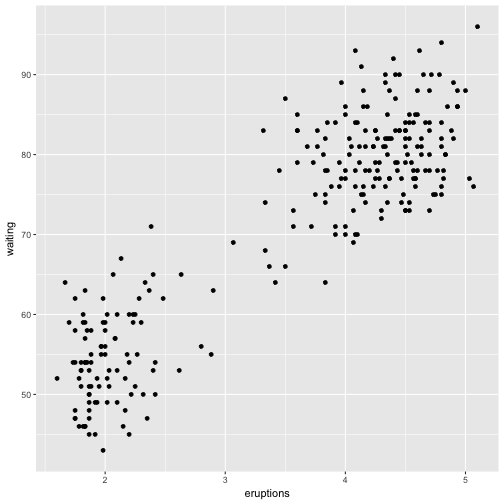
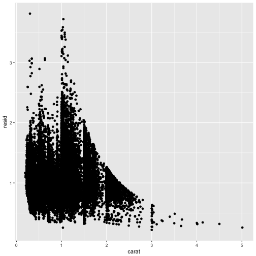
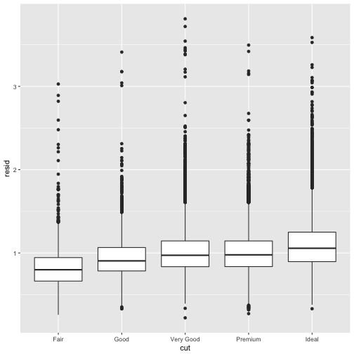
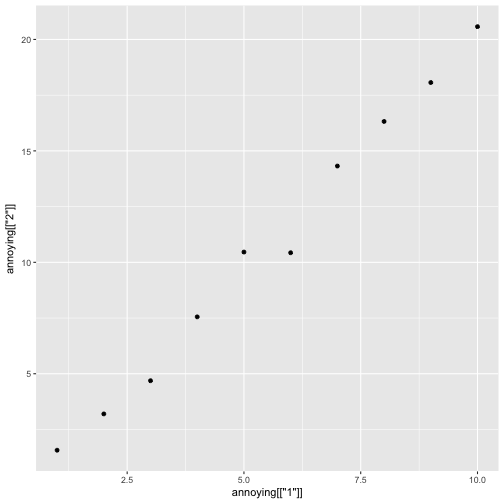

```r
library(tidyverse)
```


## 7.6 Patterns and models


```r
ggplot(data = faithful) + 
  geom_point(mapping = aes(x = eruptions, y = waiting))
```



Fits a model that predicts price from carat and computes the residuals (difference between the predicted value and actual value)


```r
library(modelr)

mod <- lm(log(price) ~ log(carat), data = diamonds)

diamonds2 <- diamonds %>% 
  add_residuals(mod) %>% 
  mutate(resid = exp(resid))

ggplot(data = diamonds2) + 
  geom_point(mapping = aes(x = carat, y = resid))
```



See residuals


```r
ggplot(data = diamonds2) + 
  geom_boxplot(mapping = aes(x = cut, y = resid))
```



## 7.7 ggplot2 calls

The first two arguments to `ggplot()` are `data` and `mapping`.

The first two arguments to `aes()` are `x` and `y`.

## 8 Workflow

Best to consider your R scripts as the final product because it's easier to recreate the environment.

Cmd + Shift + F10 to retart RStudio

Cmd + Shift + S to rerun current script

Don't use absolute paths because it hinders sharing. To address this problem, create new projects and then you can use relative paths.

## 8.5 Summary

In summary, RStudio projects give you a solid workflow that will serve you well in the future:

* Create an RStudio project for each data analysis project.

* Keep data files there; we’ll talk about loading them into R in data import.

* Keep scripts there; edit them, run them in bits or as a whole.

* Save your outputs (plots and cleaned data) there.

* Only ever use relative paths, not absolute paths.

Everything you need is in one place, and cleanly separated from all the other projects that you are working on.

## Tibbles

Creating tibbles


```r
as_tibble(iris)
```

```
## # A tibble: 150 × 5
##    Sepal.Length Sepal.Width Petal.Length Petal.Width Species
##           <dbl>       <dbl>        <dbl>       <dbl>  <fctr>
## 1           5.1         3.5          1.4         0.2  setosa
## 2           4.9         3.0          1.4         0.2  setosa
## 3           4.7         3.2          1.3         0.2  setosa
## 4           4.6         3.1          1.5         0.2  setosa
## 5           5.0         3.6          1.4         0.2  setosa
## 6           5.4         3.9          1.7         0.4  setosa
## 7           4.6         3.4          1.4         0.3  setosa
## 8           5.0         3.4          1.5         0.2  setosa
## 9           4.4         2.9          1.4         0.2  setosa
## 10          4.9         3.1          1.5         0.1  setosa
## # ... with 140 more rows
```

```r
tibble(
  x = 1:5, 
  y = 1, 
  z = x ^ 2 + y
)
```

```
## # A tibble: 5 × 3
##       x     y     z
##   <int> <dbl> <dbl>
## 1     1     1     2
## 2     2     1     5
## 3     3     1    10
## 4     4     1    17
## 5     5     1    26
```


Non-syntactic names:

Not starting with a letter or contain unusual characters like a space.

Transposed tibble `tribble()`

Column heading defined by formulas and entries are separated by commas.


```r
tribble(
  ~x, ~y, ~z,
  #--|--|----
  "a", 2, 3.6,
  "b", 1, 8.5
)
```

```
## # A tibble: 2 × 3
##       x     y     z
##   <chr> <dbl> <dbl>
## 1     a     2   3.6
## 2     b     1   8.5
```

## 10.3 Tibbles vs data.frame

Two main differences in usages of tibble vs classic data.frame: printing and subsetting

Tibbles show only the first 10 rows and all the columns that fit on the screen and each column reports its type.

Can control number of rows and width of display with `print()`


```r
nycflights13::flights %>% 
  print(n = 10, width = Inf)
```

```
## # A tibble: 336,776 × 19
##     year month   day dep_time sched_dep_time dep_delay arr_time
##    <int> <int> <int>    <int>          <int>     <dbl>    <int>
## 1   2013     1     1      517            515         2      830
## 2   2013     1     1      533            529         4      850
## 3   2013     1     1      542            540         2      923
## 4   2013     1     1      544            545        -1     1004
## 5   2013     1     1      554            600        -6      812
## 6   2013     1     1      554            558        -4      740
## 7   2013     1     1      555            600        -5      913
## 8   2013     1     1      557            600        -3      709
## 9   2013     1     1      557            600        -3      838
## 10  2013     1     1      558            600        -2      753
##    sched_arr_time arr_delay carrier flight tailnum origin  dest air_time
##             <int>     <dbl>   <chr>  <int>   <chr>  <chr> <chr>    <dbl>
## 1             819        11      UA   1545  N14228    EWR   IAH      227
## 2             830        20      UA   1714  N24211    LGA   IAH      227
## 3             850        33      AA   1141  N619AA    JFK   MIA      160
## 4            1022       -18      B6    725  N804JB    JFK   BQN      183
## 5             837       -25      DL    461  N668DN    LGA   ATL      116
## 6             728        12      UA   1696  N39463    EWR   ORD      150
## 7             854        19      B6    507  N516JB    EWR   FLL      158
## 8             723       -14      EV   5708  N829AS    LGA   IAD       53
## 9             846        -8      B6     79  N593JB    JFK   MCO      140
## 10            745         8      AA    301  N3ALAA    LGA   ORD      138
##    distance  hour minute           time_hour
##       <dbl> <dbl>  <dbl>              <dttm>
## 1      1400     5     15 2013-01-01 05:00:00
## 2      1416     5     29 2013-01-01 05:00:00
## 3      1089     5     40 2013-01-01 05:00:00
## 4      1576     5     45 2013-01-01 05:00:00
## 5       762     6      0 2013-01-01 06:00:00
## 6       719     5     58 2013-01-01 05:00:00
## 7      1065     6      0 2013-01-01 06:00:00
## 8       229     6      0 2013-01-01 06:00:00
## 9       944     6      0 2013-01-01 06:00:00
## 10      733     6      0 2013-01-01 06:00:00
## # ... with 3.368e+05 more rows
```

Control print behavior:

Print n number of rows
`options(tibble.print_max = n, tibble.print_min = m)`

Always print all columns
`options(tibble.width = Inf)`

Subsetting: `$`, `[[]]`


```r
df <- tibble(
  x = runif(5),
  y = rnorm(5)
)

# Extract by name
df$x
```

```
## [1] 0.3418982 0.7172545 0.9412275 0.9964585 0.5033021
```

```r
#> [1] 0.434 0.395 0.548 0.762 0.254
df[["x"]]
```

```
## [1] 0.3418982 0.7172545 0.9412275 0.9964585 0.5033021
```

```r
#> [1] 0.434 0.395 0.548 0.762 0.254

# Extract by position
df[[1]]
```

```
## [1] 0.3418982 0.7172545 0.9412275 0.9964585 0.5033021
```

Combine with pipe:


```r
df %>% .$x
```

```
## [1] 0.3418982 0.7172545 0.9412275 0.9964585 0.5033021
```

```r
#> [1] 0.434 0.395 0.548 0.762 0.254
df %>% .[["x"]]
```

```
## [1] 0.3418982 0.7172545 0.9412275 0.9964585 0.5033021
```

```r
#> [1] 0.434 0.395 0.548 0.762 0.254
```

To interaction with older code, turn tibble back to data frame with `as.data.frame()`

## 10.5 Exercises

1. How can you tell if an object is a tibble? (Hint: try printing mtcars, which is a regular data frame).

You can print the object. If it is a tibble, it will only print the first 10 rows and n number of columns that will fit in a screen.

2. Compare and contrast the following operations on a data.frame and equivalent tibble. What is different? Why might the default data frame behaviours cause you frustration?

As a data.frame


```r
df <- data.frame(abc = 1, xyz = "a")
df$x #this returns the value for xyz even though it's the wrong subset
```

```
## [1] a
## Levels: a
```

```r
df[, "xyz"] #returns factor
```

```
## [1] a
## Levels: a
```

```r
df[, c("abc", "xyz")] #returns the data frame
```

```
##   abc xyz
## 1   1   a
```

As a tibble


```r
df_t <- tibble(abc = 1, xyz = "a")
df_t$x #gives warning/NULL
```

```
## Warning: Unknown column 'x'
```

```
## NULL
```

```r
df_t[, "xyz"] #returns a tibble
```

```
## # A tibble: 1 × 1
##     xyz
##   <chr>
## 1     a
```

```r
df_t[, c("abc", "xyz")] #returns the tibble but xyz is chr instead of fctr
```

```
## # A tibble: 1 × 2
##     abc   xyz
##   <dbl> <chr>
## 1     1     a
```

3. If you have the name of a variable stored in an object, e.g. var <- "mpg", how can you extract the reference variable from a tibble?


```r
var <- "xyz"

df_t[[var]]
```

```
## [1] "a"
```
Double brackets

4. Practice referring to non-syntactic names in the following data frame by:


```r
annoying <- tibble(
  `1` = 1:10,
  `2` = `1` * 2 + rnorm(length(`1`))
)
```

Extracting the variable called 1.


```r
annoying[['1']]
```

```
##  [1]  1  2  3  4  5  6  7  8  9 10
```


Plotting a scatterplot of 1 vs 2.


```r
ggplot(annoying) + geom_point(aes(annoying[['1']], annoying[['2']]))
```




Creating a new column called 3 which is 2 divided by 1.


```r
annoying[['3']]<-annoying[['2']]/annoying[['1']]
annoying
```

```
## # A tibble: 10 × 3
##      `1`       `2`      `3`
##    <int>     <dbl>    <dbl>
## 1      1  1.568423 1.568423
## 2      2  3.199022 1.599511
## 3      3  4.687704 1.562568
## 4      4  7.553767 1.888442
## 5      5 10.460386 2.092077
## 6      6 10.429790 1.738298
## 7      7 14.319108 2.045587
## 8      8 16.320259 2.040032
## 9      9 18.066168 2.007352
## 10    10 20.573302 2.057330
```


Renaming the columns to one, two and three.


```r
colnames(annoying)<-c("one","two","three")
annoying
```

```
## # A tibble: 10 × 3
##      one       two    three
##    <int>     <dbl>    <dbl>
## 1      1  1.568423 1.568423
## 2      2  3.199022 1.599511
## 3      3  4.687704 1.562568
## 4      4  7.553767 1.888442
## 5      5 10.460386 2.092077
## 6      6 10.429790 1.738298
## 7      7 14.319108 2.045587
## 8      8 16.320259 2.040032
## 9      9 18.066168 2.007352
## 10    10 20.573302 2.057330
```


5. What does tibble::enframe() do? When might you use it?


```r
?tibble::enframe
enframe(1:3)
```

```
## # A tibble: 3 × 2
##    name value
##   <int> <int>
## 1     1     1
## 2     2     2
## 3     3     3
```

```r
enframe(c(a = 5, b = 7))
```

```
## # A tibble: 2 × 2
##    name value
##   <chr> <dbl>
## 1     a     5
## 2     b     7
```

Converts named atomic vectors or lists to two-column data frames. 

6. What option controls how many additional column names are printed at the footer of a tibble?

`tibble.max_extra_cols` Number of extra columns printed in reduced form.


```r
nycflights13::flights
```

```
## # A tibble: 336,776 × 19
##     year month   day dep_time sched_dep_time dep_delay arr_time
##    <int> <int> <int>    <int>          <int>     <dbl>    <int>
## 1   2013     1     1      517            515         2      830
## 2   2013     1     1      533            529         4      850
## 3   2013     1     1      542            540         2      923
## 4   2013     1     1      544            545        -1     1004
## 5   2013     1     1      554            600        -6      812
## 6   2013     1     1      554            558        -4      740
## 7   2013     1     1      555            600        -5      913
## 8   2013     1     1      557            600        -3      709
## 9   2013     1     1      557            600        -3      838
## 10  2013     1     1      558            600        -2      753
## # ... with 336,766 more rows, and 12 more variables: sched_arr_time <int>,
## #   arr_delay <dbl>, carrier <chr>, ...
```


```r
options(tibble.max_extra_cols = 3)
nycflights13::flights
```

```
## # A tibble: 336,776 × 19
##     year month   day dep_time sched_dep_time dep_delay arr_time
##    <int> <int> <int>    <int>          <int>     <dbl>    <int>
## 1   2013     1     1      517            515         2      830
## 2   2013     1     1      533            529         4      850
## 3   2013     1     1      542            540         2      923
## 4   2013     1     1      544            545        -1     1004
## 5   2013     1     1      554            600        -6      812
## 6   2013     1     1      554            558        -4      740
## 7   2013     1     1      555            600        -5      913
## 8   2013     1     1      557            600        -3      709
## 9   2013     1     1      557            600        -3      838
## 10  2013     1     1      558            600        -2      753
## # ... with 336,766 more rows, and 12 more variables: sched_arr_time <int>,
## #   arr_delay <dbl>, carrier <chr>, ...
```

