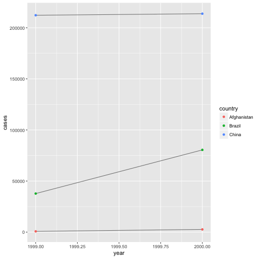
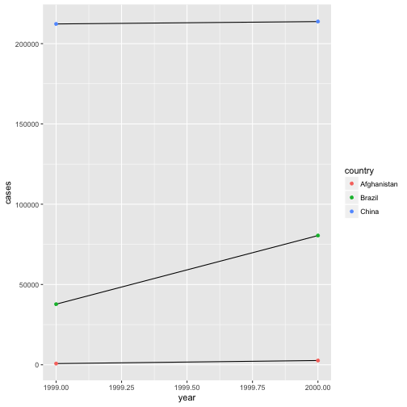

```r
library(tidyverse)
```

## Section 12.1 to 12.4

There are three interrelated rules which make a dataset tidy:

1. Each variable must have its own column.
2. Each observation must have its own row.
3. Each value must have its own cell.

Why ensure that your data is tidy? There are two main advantages:

There’s a general advantage to picking one consistent way of storing data. If you have a consistent data structure, it’s easier to learn the tools that work with it because they have an underlying uniformity.

There’s a specific advantage to placing variables in columns because it allows R’s vectorised nature to shine. As you learned in mutate and summary functions, most built-in R functions work with vectors of values. That makes transforming tidy data feel particularly natural.

## 12.2.1 Exercises

1. Using prose, describe how the variables and observations are organised in each of the sample tables.

table1: this is the tidy version of the data where each column is a variable and each observation has its own row.

table2: each observation has two rows because the cases and population variable are in one column under type.

table3: each observation has its own row but the variables for cases and population are condensed into the rate variable that are separated by a forward slash.

table4a and 4b: two tibbles. The first tibble contains the cases and the second tibble contains the population data. Year is no longer in its own column and separated into two columns based on which year.

2. Compute the rate for table2, and table4a + table4b. You will need to perform four operations:

Extract the number of TB cases per country per year.
Extract the matching population per country per year.
Divide cases by population, and multiply by 10000.
Store back in the appropriate place.

Which representation is easiest to work with? Which is hardest? Why?

for table2


```r
tb2cases<-table2 %>% filter(type=="cases")
tb2cases<-rename(tb2cases, cases=count)
tb2cases<-select(tb2cases,-type)
tb2pop<-table2 %>% filter(type=="population")
tb2pop<-rename(tb2pop, population=count)
tb2pop<-select(tb2pop, -type)
tb2<-full_join(tb2pop, tb2cases)
```

```
## Joining, by = c("country", "year")
```

```r
tb2<-tb2 %>% mutate(rate=cases/population *10000)
```

for table4a


```r
table4a
```

```
## # A tibble: 3 × 3
##       country `1999` `2000`
## *       <chr>  <int>  <int>
## 1 Afghanistan    745   2666
## 2      Brazil  37737  80488
## 3       China 212258 213766
```

```r
tb4<-tibble(country=rep(c("Afghanistan", "Brazil", "China"), times = 2),
            year=c(rep(1999, times=3), rep(2000, times=3)),
            cases=c(table4a$`1999`,table4a$`2000`),
            population=c(table4b$`1999`,table4b$`2000`))
tb4<-tb4 %>% mutate(rate=cases/population *10000)
```

table4a and 4b harder because harder to subset. Can do operations but hard to store in appropriate places.

Recreate the plot showing change in cases over time using table2 instead of table1. What do you need to do first?


```r
ggplot(table1, aes(year, cases)) + 
  geom_line(aes(group = country), colour = "grey50") + 
  geom_point(aes(colour = country))
```




```r
table2 %>% filter(type=="cases") %>% ggplot(aes(year, count)) + geom_line(aes(group=country)) + geom_point(aes(color=country)) + ylab("cases")
```



## 12.3.3 Exercises

1. Why are gather() and spread() not perfectly symmetrical?

Carefully consider the following example:


```r
stocks <- tibble(
  year   = c(2015, 2015, 2016, 2016),
  half  = c(   1,    2,     1,    2),
  return = c(1.88, 0.59, 0.92, 0.17)
)
stocks %>% 
  spread(year, return) %>% 
  gather("year", "return", `2015`:`2016`)
```

```
## # A tibble: 4 × 3
##    half  year return
##   <dbl> <chr>  <dbl>
## 1     1  2015   1.88
## 2     2  2015   0.59
## 3     1  2016   0.92
## 4     2  2016   0.17
```

(Hint: look at the variable types and think about column names.)

Because you have to specify the columns to gather whereas you don't in spread.

Both spread() and gather() have a convert argument. What does it do?

If TRUE, will run type.convert on key column/each of the new columns, useful if the value column was a mix of variables that was coerced to a string.

2. Why does this code fail?


```r
table4a %>% 
  gather(1999, 2000, key = "year", value = "cases")
```

```
## Error in eval(expr, envir, enclos): Position must be between 0 and n
```

The column names are not being read correctly.


```r
table4a %>% 
  gather(`1999`,`2000`, key = "year", value = "cases")
```

```
## # A tibble: 6 × 3
##       country  year  cases
##         <chr> <chr>  <int>
## 1 Afghanistan  1999    745
## 2      Brazil  1999  37737
## 3       China  1999 212258
## 4 Afghanistan  2000   2666
## 5      Brazil  2000  80488
## 6       China  2000 213766
```

3. Why does spreading this tibble fail? How could you add a new column to fix the problem?


```r
people <- tribble(
  ~name,             ~key,    ~value,
  #-----------------|--------|------
  "Phillip Woods",   "age",       45,
  "Phillip Woods",   "height",   186,
  "Phillip Woods",   "age",       50,
  "Jessica Cordero", "age",       37,
  "Jessica Cordero", "height",   156
)
```

There are two entries for age for Phillip Woods. Can add a new column to differentiate the two observations


```r
people$obs<-c(1,1,2,1,1)
spread(people, key, value)
```

```
## # A tibble: 3 × 4
##              name   obs   age height
## *           <chr> <dbl> <dbl>  <dbl>
## 1 Jessica Cordero     1    37    156
## 2   Phillip Woods     1    45    186
## 3   Phillip Woods     2    50     NA
```


4. Tidy the simple tibble below. Do you need to spread or gather it? What are the variables?


```r
preg <- tribble(
  ~pregnant, ~male, ~female,
  "yes",     NA,    10,
  "no",      20,    12
)
```


```r
gather(preg, gender, count, male:female)
```

```
## # A tibble: 4 × 3
##   pregnant gender count
##      <chr>  <chr> <dbl>
## 1      yes   male    NA
## 2       no   male    20
## 3      yes female    10
## 4       no female    12
```

## 12.4.3 Exercises

1. What do the extra and fill arguments do in separate()? Experiment with the various options for the following two toy datasets.

exta controls what happens when there are too many pieces
fill controls what happens when there are not enough pieces


```r
tibble(x = c("a,b,c", "d,e,f,g", "h,i,j")) %>% #too many pieces
  separate(x, c("one", "two", "three"), extra="warn")
```

```
## Warning: Too many values at 1 locations: 2
```

```
## # A tibble: 3 × 3
##     one   two three
## * <chr> <chr> <chr>
## 1     a     b     c
## 2     d     e     f
## 3     h     i     j
```

```r
tibble(x = c("a,b,c", "d,e,f,g", "h,i,j")) %>% #too many pieces
  separate(x, c("one", "two", "three"), extra="drop")
```

```
## # A tibble: 3 × 3
##     one   two three
## * <chr> <chr> <chr>
## 1     a     b     c
## 2     d     e     f
## 3     h     i     j
```

```r
tibble(x = c("a,b,c", "d,e,f,g", "h,i,j")) %>% #too many pieces
  separate(x, c("one", "two", "three"), extra="merge")
```

```
## # A tibble: 3 × 3
##     one   two three
## * <chr> <chr> <chr>
## 1     a     b     c
## 2     d     e   f,g
## 3     h     i     j
```

```r
tibble(x = c("a,b,c", "d,e", "f,g,i")) %>% 
  separate(x, c("one", "two", "three"), fill="warn")
```

```
## Warning: Too few values at 1 locations: 2
```

```
## # A tibble: 3 × 3
##     one   two three
## * <chr> <chr> <chr>
## 1     a     b     c
## 2     d     e  <NA>
## 3     f     g     i
```

```r
tibble(x = c("a,b,c", "d,e", "f,g,i")) %>% 
  separate(x, c("one", "two", "three"), fill="right") #change where to put the NA, in column three, same as warn
```

```
## # A tibble: 3 × 3
##     one   two three
## * <chr> <chr> <chr>
## 1     a     b     c
## 2     d     e  <NA>
## 3     f     g     i
```

```r
tibble(x = c("a,b,c", "d,e", "f,g,i")) %>% 
  separate(x, c("one", "two", "three"), fill="left") #changes where to put the NA, in column one
```

```
## # A tibble: 3 × 3
##     one   two three
## * <chr> <chr> <chr>
## 1     a     b     c
## 2  <NA>     d     e
## 3     f     g     i
```

```r
#what if want to put NA in column two
```

2. Both unite() and separate() have a remove argument. What does it do? Why would you set it to FALSE?

if true, remove input column from output dataframe


```r
table5
```

```
## # A tibble: 6 × 4
##       country century  year              rate
## *       <chr>   <chr> <chr>             <chr>
## 1 Afghanistan      19    99      745/19987071
## 2 Afghanistan      20    00     2666/20595360
## 3      Brazil      19    99   37737/172006362
## 4      Brazil      20    00   80488/174504898
## 5       China      19    99 212258/1272915272
## 6       China      20    00 213766/1280428583
```

```r
table5 %>% 
  unite(new, century, year)
```

```
## # A tibble: 6 × 3
##       country   new              rate
## *       <chr> <chr>             <chr>
## 1 Afghanistan 19_99      745/19987071
## 2 Afghanistan 20_00     2666/20595360
## 3      Brazil 19_99   37737/172006362
## 4      Brazil 20_00   80488/174504898
## 5       China 19_99 212258/1272915272
## 6       China 20_00 213766/1280428583
```

```r
table5 %>% 
  unite(new, century, year, remove=TRUE)
```

```
## # A tibble: 6 × 3
##       country   new              rate
## *       <chr> <chr>             <chr>
## 1 Afghanistan 19_99      745/19987071
## 2 Afghanistan 20_00     2666/20595360
## 3      Brazil 19_99   37737/172006362
## 4      Brazil 20_00   80488/174504898
## 5       China 19_99 212258/1272915272
## 6       China 20_00 213766/1280428583
```

```r
table5 %>% 
  unite(new, century, year, remove=FALSE)
```

```
## # A tibble: 6 × 5
##       country   new century  year              rate
## *       <chr> <chr>   <chr> <chr>             <chr>
## 1 Afghanistan 19_99      19    99      745/19987071
## 2 Afghanistan 20_00      20    00     2666/20595360
## 3      Brazil 19_99      19    99   37737/172006362
## 4      Brazil 20_00      20    00   80488/174504898
## 5       China 19_99      19    99 212258/1272915272
## 6       China 20_00      20    00 213766/1280428583
```

Set to false if you want to keep the original as a way to double check that the unite() and separate() worked properly.

3. Compare and contrast separate() and extract(). Why are there three variations of separation (by position, by separator, and with groups), but only one unite?


```r
?extract
```

Extract one column into multiple based on regular expression with capturing group.


```r
df <- data.frame(x = c(NA, "a-b", "a-d", "b-c", "d-e"))
df
```

```
##      x
## 1 <NA>
## 2  a-b
## 3  a-d
## 4  b-c
## 5  d-e
```

```r
df %>% extract(x, "A")
```

```
##      A
## 1 <NA>
## 2    a
## 3    a
## 4    b
## 5    d
```

```r
df %>% extract(x, c("A", "B"), "([[:alnum:]]+)-([[:alnum:]]+)") #not familiar with regex so who knows what this means
```

```
##      A    B
## 1 <NA> <NA>
## 2    a    b
## 3    a    d
## 4    b    c
## 5    d    e
```

There are many ways to split one column into many (regex, position or separator are all valid way s to separate a column) but only one way to combine many columns into one.
