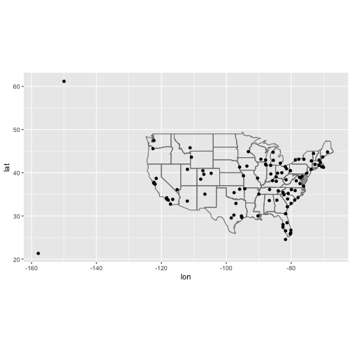
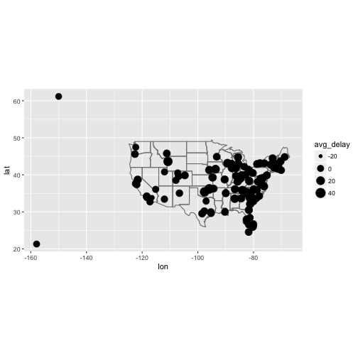
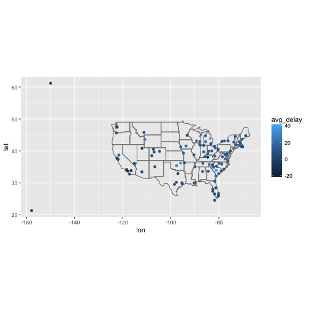
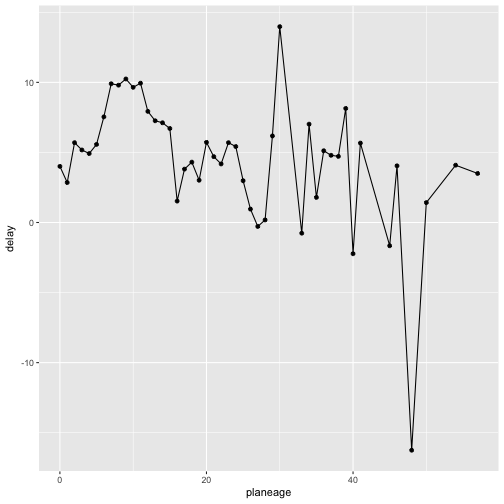
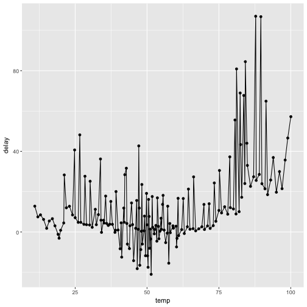
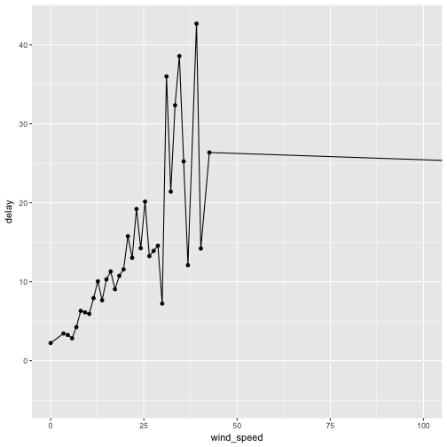
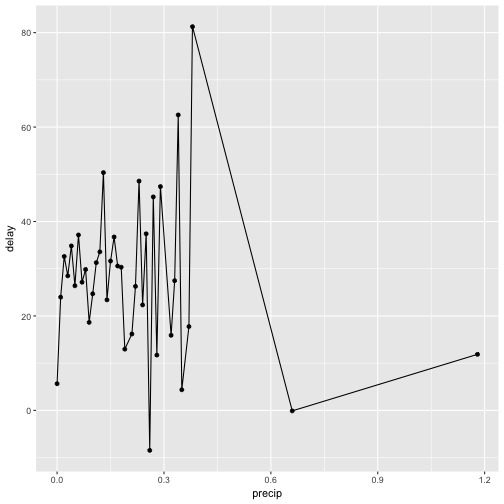
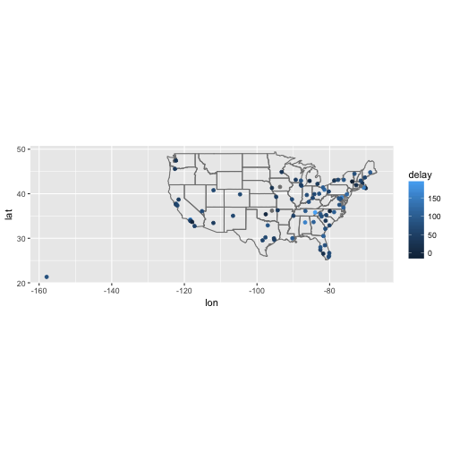

```r
library(tidyverse)
library(nycflights13)
```

There are two types of keys:

* A primary key uniquely identifies an observation in its own table. For example, planes$tailnum is a primary key because it uniquely identifies each plane in the planes table.

* A foreign key uniquely identifies an observation in another table. For example, the flights$tailnum is a foreign key because it appears in the flights table where it matches each flight to a unique plane.


```r
planes %>% count(tailnum) %>% filter(n>1)
```

```
## # A tibble: 0 x 2
## # ... with 2 variables: tailnum <chr>, n <int>
```

```r
weather %>% 
  count(year, month, day, hour, origin) %>% 
  filter(n > 1)
```

```
## # A tibble: 0 x 6
## # ... with 6 variables: year <dbl>, month <dbl>, day <int>, hour <int>,
## #   origin <chr>, n <int>
```


### 13.3.1 Exercises

1. Add a surrogate key to flights.


```r
flights %>% arrange(year,month,day, tailnum) %>% mutate(flight_key = row_number())
```

```
## # A tibble: 336,776 x 20
##     year month   day dep_time sched_dep_time dep_delay arr_time
##    <int> <int> <int>    <int>          <int>     <dbl>    <int>
##  1  2013     1     1     1604           1510        54     1817
##  2  2013     1     1     2100           2100         0     2307
##  3  2013     1     1      624            630        -6      909
##  4  2013     1     1     1828           1805        23     2023
##  5  2013     1     1     1030           1035        -5     1229
##  6  2013     1     1     2026           2004        22     2157
##  7  2013     1     1      811            815        -4     1006
##  8  2013     1     1     1952           1930        22     2358
##  9  2013     1     1     2003           2000         3     2302
## 10  2013     1     1     1202           1207        -5     1318
## # ... with 336,766 more rows, and 13 more variables: sched_arr_time <int>,
## #   arr_delay <dbl>, carrier <chr>, flight <int>, tailnum <chr>,
## #   origin <chr>, dest <chr>, air_time <dbl>, distance <dbl>, hour <dbl>,
## #   minute <dbl>, time_hour <dttm>, flight_key <int>
```


2. Identify the keys in the following datasets

Lahman::Batting,


```r
Lahman::Batting %>% group_by(playerID, yearID, stint)
```

```
## # A tibble: 101,332 x 22
## # Groups:   playerID, yearID, stint [101,332]
##     playerID yearID stint teamID   lgID     G    AB     R     H   X2B
##        <chr>  <int> <int> <fctr> <fctr> <int> <int> <int> <int> <int>
##  1 abercda01   1871     1    TRO     NA     1     4     0     0     0
##  2  addybo01   1871     1    RC1     NA    25   118    30    32     6
##  3 allisar01   1871     1    CL1     NA    29   137    28    40     4
##  4 allisdo01   1871     1    WS3     NA    27   133    28    44    10
##  5 ansonca01   1871     1    RC1     NA    25   120    29    39    11
##  6 armstbo01   1871     1    FW1     NA    12    49     9    11     2
##  7 barkeal01   1871     1    RC1     NA     1     4     0     1     0
##  8 barnero01   1871     1    BS1     NA    31   157    66    63    10
##  9 barrebi01   1871     1    FW1     NA     1     5     1     1     1
## 10 barrofr01   1871     1    BS1     NA    18    86    13    13     2
## # ... with 101,322 more rows, and 12 more variables: X3B <int>, HR <int>,
## #   RBI <int>, SB <int>, CS <int>, BB <int>, SO <int>, IBB <int>,
## #   HBP <int>, SH <int>, SF <int>, GIDP <int>
```


```r
babynames::babynames %>% group_by(name, year, sex)
```

```
## # A tibble: 1,858,689 x 5
## # Groups:   name, year, sex [1,858,689]
##     year   sex      name     n       prop
##    <dbl> <chr>     <chr> <int>      <dbl>
##  1  1880     F      Mary  7065 0.07238433
##  2  1880     F      Anna  2604 0.02667923
##  3  1880     F      Emma  2003 0.02052170
##  4  1880     F Elizabeth  1939 0.01986599
##  5  1880     F    Minnie  1746 0.01788861
##  6  1880     F  Margaret  1578 0.01616737
##  7  1880     F       Ida  1472 0.01508135
##  8  1880     F     Alice  1414 0.01448711
##  9  1880     F    Bertha  1320 0.01352404
## 10  1880     F     Sarah  1288 0.01319618
## # ... with 1,858,679 more rows
```


```r
nasaweather::atmos %>% group_by(year, month, lat, long)
```

```
## # A tibble: 41,472 x 11
## # Groups:   year, month, lat, long [41,472]
##         lat   long  year month surftemp  temp pressure ozone cloudlow
##       <dbl>  <dbl> <int> <int>    <dbl> <dbl>    <dbl> <dbl>    <dbl>
##  1 36.20000 -113.8  1995     1    272.7 272.1      835   304      7.5
##  2 33.70435 -113.8  1995     1    279.5 282.2      940   304     11.5
##  3 31.20870 -113.8  1995     1    284.7 285.2      960   298     16.5
##  4 28.71304 -113.8  1995     1    289.3 290.7      990   276     20.5
##  5 26.21739 -113.8  1995     1    292.2 292.7     1000   274     26.0
##  6 23.72174 -113.8  1995     1    294.1 293.6     1000   264     30.0
##  7 21.22609 -113.8  1995     1    295.0 294.6     1000   258     29.5
##  8 18.73043 -113.8  1995     1    298.3 296.9     1000   252     26.5
##  9 16.23478 -113.8  1995     1    300.1 297.8     1000   250     27.5
## 10 13.73913 -113.8  1995     1    300.1 298.7     1000   250     26.0
## # ... with 41,462 more rows, and 2 more variables: cloudmid <dbl>,
## #   cloudhigh <dbl>
```


```r
fueleconomy::vehicles %>% group_by(id)
```

```
## # A tibble: 33,442 x 12
## # Groups:   id [33,442]
##       id             make               model  year
##    <int>            <chr>               <chr> <int>
##  1 27550       AM General   DJ Po Vehicle 2WD  1984
##  2 28426       AM General   DJ Po Vehicle 2WD  1984
##  3 27549       AM General    FJ8c Post Office  1984
##  4 28425       AM General    FJ8c Post Office  1984
##  5  1032       AM General Post Office DJ5 2WD  1985
##  6  1033       AM General Post Office DJ8 2WD  1985
##  7  3347 ASC Incorporated                 GNX  1987
##  8 13309            Acura         2.2CL/3.0CL  1997
##  9 13310            Acura         2.2CL/3.0CL  1997
## 10 13311            Acura         2.2CL/3.0CL  1997
## # ... with 33,432 more rows, and 8 more variables: class <chr>,
## #   trans <chr>, drive <chr>, cyl <int>, displ <dbl>, fuel <chr>,
## #   hwy <int>, cty <int>
```


```r
ggplot2::diamonds %>% group_by(cut, color, clarity, carat, depth, price, x, y, z, table ) %>% mutate(diamond_key = row_number())
```

```
## # A tibble: 53,940 x 11
## # Groups:   cut, color, clarity, carat, depth, price, x, y, z, table
## #   [53,794]
##    carat       cut color clarity depth table price     x     y     z
##    <dbl>     <ord> <ord>   <ord> <dbl> <dbl> <int> <dbl> <dbl> <dbl>
##  1  0.23     Ideal     E     SI2  61.5    55   326  3.95  3.98  2.43
##  2  0.21   Premium     E     SI1  59.8    61   326  3.89  3.84  2.31
##  3  0.23      Good     E     VS1  56.9    65   327  4.05  4.07  2.31
##  4  0.29   Premium     I     VS2  62.4    58   334  4.20  4.23  2.63
##  5  0.31      Good     J     SI2  63.3    58   335  4.34  4.35  2.75
##  6  0.24 Very Good     J    VVS2  62.8    57   336  3.94  3.96  2.48
##  7  0.24 Very Good     I    VVS1  62.3    57   336  3.95  3.98  2.47
##  8  0.26 Very Good     H     SI1  61.9    55   337  4.07  4.11  2.53
##  9  0.22      Fair     E     VS2  65.1    61   337  3.87  3.78  2.49
## 10  0.23 Very Good     H     VS1  59.4    61   338  4.00  4.05  2.39
## # ... with 53,930 more rows, and 1 more variables: diamond_key <int>
```

```r
## have to make a key
```

(You might need to install some packages and read some documentation.)

3. Draw a diagram illustrating the connections between the Batting, Master, and Salaries tables in the Lahman package. Draw another diagram that shows the relationship between Master, Managers, AwardsManagers.


```r
library(Lahman)
colnames(Batting)
```

```
##  [1] "playerID" "yearID"   "stint"    "teamID"   "lgID"     "G"       
##  [7] "AB"       "R"        "H"        "X2B"      "X3B"      "HR"      
## [13] "RBI"      "SB"       "CS"       "BB"       "SO"       "IBB"     
## [19] "HBP"      "SH"       "SF"       "GIDP"
```

```r
colnames(Master)
```

```
##  [1] "playerID"     "birthYear"    "birthMonth"   "birthDay"    
##  [5] "birthCountry" "birthState"   "birthCity"    "deathYear"   
##  [9] "deathMonth"   "deathDay"     "deathCountry" "deathState"  
## [13] "deathCity"    "nameFirst"    "nameLast"     "nameGiven"   
## [17] "weight"       "height"       "bats"         "throws"      
## [21] "debut"        "finalGame"    "retroID"      "bbrefID"     
## [25] "deathDate"    "birthDate"
```

```r
colnames(Salaries)
```

```
## [1] "yearID"   "teamID"   "lgID"     "playerID" "salary"
```

```r
colnames(Managers)
```

```
##  [1] "playerID" "yearID"   "teamID"   "lgID"     "inseason" "G"       
##  [7] "W"        "L"        "rank"     "plyrMgr"
```

```r
colnames(AwardsManagers)
```

```
## [1] "playerID" "awardID"  "yearID"   "lgID"     "tie"      "notes"
```

Batting to Master: playerID
Batting to Salaries: playerID, yearID, teamID
Master to Salaries: playerID

Master to Manager: playerID
Master to AwardsManager: playerID
Manager to AwardsManager: playerID, yearID

How would you characterise the relationship between the Batting, Pitching, and Fielding tables?


```r
colnames(Batting)
```

```
##  [1] "playerID" "yearID"   "stint"    "teamID"   "lgID"     "G"       
##  [7] "AB"       "R"        "H"        "X2B"      "X3B"      "HR"      
## [13] "RBI"      "SB"       "CS"       "BB"       "SO"       "IBB"     
## [19] "HBP"      "SH"       "SF"       "GIDP"
```

```r
colnames(Pitching)
```

```
##  [1] "playerID" "yearID"   "stint"    "teamID"   "lgID"     "W"       
##  [7] "L"        "G"        "GS"       "CG"       "SHO"      "SV"      
## [13] "IPouts"   "H"        "ER"       "HR"       "BB"       "SO"      
## [19] "BAOpp"    "ERA"      "IBB"      "WP"       "HBP"      "BK"      
## [25] "BFP"      "GF"       "R"        "SH"       "SF"       "GIDP"
```

```r
colnames(Fielding)
```

```
##  [1] "playerID" "yearID"   "stint"    "teamID"   "lgID"     "POS"     
##  [7] "G"        "GS"       "InnOuts"  "PO"       "A"        "E"       
## [13] "DP"       "PB"       "WP"       "SB"       "CS"       "ZR"
```

Batting to Pitching: playerID, yearID, stint, teamID
They share the same primary ID based on player, year and stint

### 13.4.6 Exercises

1. Compute the average delay by destination, then join on the airports data frame so you can show the spatial distribution of delays. Here’s an easy way to draw a map of the United States:


```r
airports %>%
  semi_join(flights, c("faa" = "dest")) %>%
  ggplot(aes(lon, lat)) +
    borders("state") +
    geom_point() +
    coord_quickmap()
```



```r
flights %>% group_by(dest) %>% summarise(avg_delay = mean(arr_delay, na.rm = T)) %>% inner_join(airports, by = c(dest="faa")) %>% ggplot(aes(lon, lat, size = avg_delay)) +
    borders("state") +
    geom_point() +
    coord_quickmap()
```

```
## Warning: Removed 1 rows containing missing values (geom_point).
```



```r
flights %>% group_by(dest) %>% summarise(avg_delay = mean(arr_delay, na.rm = T)) %>% inner_join(airports, by = c(dest="faa")) %>% ggplot(aes(lon, lat, color = avg_delay)) +
    borders("state") +
    geom_point() +
    coord_quickmap()
```




(Don’t worry if you don’t understand what semi_join() does — you’ll learn about it next.)

You might want to use the size or colour of the points to display the average delay for each airport.

2. Add the location of the origin and destination (i.e. the lat and lon) to flights.


```r
flights
```

```
## # A tibble: 336,776 x 19
##     year month   day dep_time sched_dep_time dep_delay arr_time
##    <int> <int> <int>    <int>          <int>     <dbl>    <int>
##  1  2013     1     1      517            515         2      830
##  2  2013     1     1      533            529         4      850
##  3  2013     1     1      542            540         2      923
##  4  2013     1     1      544            545        -1     1004
##  5  2013     1     1      554            600        -6      812
##  6  2013     1     1      554            558        -4      740
##  7  2013     1     1      555            600        -5      913
##  8  2013     1     1      557            600        -3      709
##  9  2013     1     1      557            600        -3      838
## 10  2013     1     1      558            600        -2      753
## # ... with 336,766 more rows, and 12 more variables: sched_arr_time <int>,
## #   arr_delay <dbl>, carrier <chr>, flight <int>, tailnum <chr>,
## #   origin <chr>, dest <chr>, air_time <dbl>, distance <dbl>, hour <dbl>,
## #   minute <dbl>, time_hour <dttm>
```

```r
airports
```

```
## # A tibble: 1,458 x 8
##      faa                           name      lat        lon   alt    tz
##    <chr>                          <chr>    <dbl>      <dbl> <int> <dbl>
##  1   04G              Lansdowne Airport 41.13047  -80.61958  1044    -5
##  2   06A  Moton Field Municipal Airport 32.46057  -85.68003   264    -6
##  3   06C            Schaumburg Regional 41.98934  -88.10124   801    -6
##  4   06N                Randall Airport 41.43191  -74.39156   523    -5
##  5   09J          Jekyll Island Airport 31.07447  -81.42778    11    -5
##  6   0A9 Elizabethton Municipal Airport 36.37122  -82.17342  1593    -5
##  7   0G6        Williams County Airport 41.46731  -84.50678   730    -5
##  8   0G7  Finger Lakes Regional Airport 42.88356  -76.78123   492    -5
##  9   0P2   Shoestring Aviation Airfield 39.79482  -76.64719  1000    -5
## 10   0S9          Jefferson County Intl 48.05381 -122.81064   108    -8
## # ... with 1,448 more rows, and 2 more variables: dst <chr>, tzone <chr>
```

```r
flights %>% left_join(airports, c(origin="faa")) %>% left_join(airports, c(dest="faa"))
```

```
## # A tibble: 336,776 x 33
##     year month   day dep_time sched_dep_time dep_delay arr_time
##    <int> <int> <int>    <int>          <int>     <dbl>    <int>
##  1  2013     1     1      517            515         2      830
##  2  2013     1     1      533            529         4      850
##  3  2013     1     1      542            540         2      923
##  4  2013     1     1      544            545        -1     1004
##  5  2013     1     1      554            600        -6      812
##  6  2013     1     1      554            558        -4      740
##  7  2013     1     1      555            600        -5      913
##  8  2013     1     1      557            600        -3      709
##  9  2013     1     1      557            600        -3      838
## 10  2013     1     1      558            600        -2      753
## # ... with 336,766 more rows, and 26 more variables: sched_arr_time <int>,
## #   arr_delay <dbl>, carrier <chr>, flight <int>, tailnum <chr>,
## #   origin <chr>, dest <chr>, air_time <dbl>, distance <dbl>, hour <dbl>,
## #   minute <dbl>, time_hour <dttm>, name.x <chr>, lat.x <dbl>,
## #   lon.x <dbl>, alt.x <int>, tz.x <dbl>, dst.x <chr>, tzone.x <chr>,
## #   name.y <chr>, lat.y <dbl>, lon.y <dbl>, alt.y <int>, tz.y <dbl>,
## #   dst.y <chr>, tzone.y <chr>
```


3. Is there a relationship between the age of a plane and its delays?


```r
age<-planes %>% select(tailnum, year) %>% mutate(planeage=2013-year)
flights %>% left_join(age, by="tailnum") %>% group_by(planeage) %>% summarise(delay=mean(arr_delay, na.rm=T)) %>%ggplot(aes(planeage, delay)) + geom_point() + geom_line()
```

```
## Warning: Removed 2 rows containing missing values (geom_point).
```

```
## Warning: Removed 2 rows containing missing values (geom_path).
```



Don't really see a relationship between plane age and delay

4. What weather conditions make it more likely to see a delay?


```r
flights %>% inner_join(weather, by=c("origin", "year", "month", "day", "hour")) %>% group_by(temp) %>% summarise(delay=mean(arr_delay, na.rm=T)) %>% ggplot(aes(temp, delay)) + geom_point() + geom_line() 
```

```
## Warning: Removed 1 rows containing missing values (geom_point).
```

```
## Warning: Removed 1 rows containing missing values (geom_path).
```




```r
flights %>% inner_join(weather, by=c("origin", "year", "month", "day", "hour")) %>% group_by(wind_speed) %>% summarise(delay=mean(arr_delay, na.rm=T)) %>% ggplot(aes(wind_speed, delay)) + geom_point() + geom_line() + coord_cartesian(xlim = c(0,100))
```

```
## Warning: Removed 1 rows containing missing values (geom_point).
```

```
## Warning: Removed 1 rows containing missing values (geom_path).
```




```r
flights %>% inner_join(weather, by=c("origin", "year", "month", "day", "hour")) %>% group_by(precip) %>% summarise(delay=mean(arr_delay, na.rm=T)) %>% ggplot(aes(precip, delay)) + geom_point() + geom_line()
```




5. What happened on June 13 2013? Display the spatial pattern of delays, and then use Google to cross-reference with the weather.

Severe storms over east coast


```r
flights %>% filter(month==6, day==13) %>% group_by(dest) %>% summarise(delay=mean(arr_delay, na.rm=T)) %>% inner_join(airports, by=c("dest"="faa")) %>% ggplot(aes(y = lat, x = lon, colour = delay)) + borders("state") +
    geom_point() +
    coord_quickmap()
```



### 13.5.1 Exercises

1. What does it mean for a flight to have a missing tailnum? What do the tail numbers that don’t have a matching record in planes have in common? (Hint: one variable explains ~90% of the problems.)


```r
flights %>% anti_join(planes, by = "tailnum")
```

```
## # A tibble: 52,606 x 19
##     year month   day dep_time sched_dep_time dep_delay arr_time
##    <int> <int> <int>    <int>          <int>     <dbl>    <int>
##  1  2013     6     9     1453           1455        -2     1755
##  2  2013     5    29     2055           2040        15     2228
##  3  2013     5    30      831            755        36      929
##  4  2013     5    30     1151           1155        -4     1308
##  5  2013     5    31     1258           1300        -2     1427
##  6  2013     6     1      846            850        -4     1013
##  7  2013     6     1     1256           1300        -4     1421
##  8  2013     6    21     1247           1250        -3     1417
##  9  2013     6    22     1242           1250        -8     1413
## 10  2013     6    23     2205           2140        25     2328
## # ... with 52,596 more rows, and 12 more variables: sched_arr_time <int>,
## #   arr_delay <dbl>, carrier <chr>, flight <int>, tailnum <chr>,
## #   origin <chr>, dest <chr>, air_time <dbl>, distance <dbl>, hour <dbl>,
## #   minute <dbl>, time_hour <dttm>
```

Carriers AA and MQ no tailnum

2. Filter flights to only show flights with planes that have flown at least 100 flights.


```r
plane100<-flights %>% group_by(tailnum) %>% count() %>% filter(n>100) 

flights %>% filter(tailnum %in% plane100$tailnum)
```

```
## # A tibble: 229,202 x 19
##     year month   day dep_time sched_dep_time dep_delay arr_time
##    <int> <int> <int>    <int>          <int>     <dbl>    <int>
##  1  2013     1     1      517            515         2      830
##  2  2013     1     1      533            529         4      850
##  3  2013     1     1      544            545        -1     1004
##  4  2013     1     1      554            558        -4      740
##  5  2013     1     1      555            600        -5      913
##  6  2013     1     1      557            600        -3      709
##  7  2013     1     1      557            600        -3      838
##  8  2013     1     1      558            600        -2      849
##  9  2013     1     1      558            600        -2      853
## 10  2013     1     1      558            600        -2      923
## # ... with 229,192 more rows, and 12 more variables: sched_arr_time <int>,
## #   arr_delay <dbl>, carrier <chr>, flight <int>, tailnum <chr>,
## #   origin <chr>, dest <chr>, air_time <dbl>, distance <dbl>, hour <dbl>,
## #   minute <dbl>, time_hour <dttm>
```


3. Combine fueleconomy::vehicles and fueleconomy::common to find only the records for the most common models.


```r
library(fueleconomy)

semi_join(vehicles, common, by=c("make", "model"))
```

```
## # A tibble: 14,531 x 12
##       id  make   model  year           class           trans
##    <int> <chr>   <chr> <int>           <chr>           <chr>
##  1  1833 Acura Integra  1986 Subcompact Cars Automatic 4-spd
##  2  1834 Acura Integra  1986 Subcompact Cars    Manual 5-spd
##  3  3037 Acura Integra  1987 Subcompact Cars Automatic 4-spd
##  4  3038 Acura Integra  1987 Subcompact Cars    Manual 5-spd
##  5  4183 Acura Integra  1988 Subcompact Cars Automatic 4-spd
##  6  4184 Acura Integra  1988 Subcompact Cars    Manual 5-spd
##  7  5303 Acura Integra  1989 Subcompact Cars Automatic 4-spd
##  8  5304 Acura Integra  1989 Subcompact Cars    Manual 5-spd
##  9  6442 Acura Integra  1990 Subcompact Cars Automatic 4-spd
## 10  6443 Acura Integra  1990 Subcompact Cars    Manual 5-spd
## # ... with 14,521 more rows, and 6 more variables: drive <chr>, cyl <int>,
## #   displ <dbl>, fuel <chr>, hwy <int>, cty <int>
```


4. Find the 48 hours (over the course of the whole year) that have the worst delays. Cross-reference it with the weather data. Can you see any patterns?

Confusing about the 48 hour part


```r
flights %>% group_by(month,day,hour) %>% summarise(delay=mean(arr_delay, na.rm=T)) %>% arrange(desc(delay)) %>% slice(1:48) %>% right_join(weather) #not sure where to go from here
```

```
## Joining, by = c("month", "day", "hour")
```

```
## # A tibble: 26,130 x 16
## # Groups:   month, day [?]
##    month   day  hour      delay origin  year  temp  dewp humid wind_dir
##    <dbl> <int> <dbl>      <dbl>  <chr> <dbl> <dbl> <dbl> <dbl>    <dbl>
##  1     1     1     0         NA    EWR  2013 37.04 21.92 53.97      230
##  2     1     1     1         NA    EWR  2013 37.04 21.92 53.97      230
##  3     1     1     2         NA    EWR  2013 37.94 21.92 52.09      230
##  4     1     1     3         NA    EWR  2013 37.94 23.00 54.51      230
##  5     1     1     4         NA    EWR  2013 37.94 24.08 57.04      240
##  6     1     1     6  3.7843137    EWR  2013 39.02 26.06 59.37      270
##  7     1     1     7  3.7551020    EWR  2013 39.02 26.96 61.63      250
##  8     1     1     8 -2.3965517    EWR  2013 39.02 28.04 64.43      240
##  9     1     1     9  5.5535714    EWR  2013 39.92 28.04 62.21      250
## 10     1     1    10  0.6410256    EWR  2013 39.02 28.04 64.43      260
## # ... with 26,120 more rows, and 6 more variables: wind_speed <dbl>,
## #   wind_gust <dbl>, precip <dbl>, pressure <dbl>, visib <dbl>,
## #   time_hour <dttm>
```


5. What does anti_join(flights, airports, by = c("dest" = "faa")) tell you? What does anti_join(airports, flights, by = c("faa" = "dest")) tell you?


```r
anti_join(flights, airports, by = c("dest" = "faa")) #the flights do not go to these airports
```

```
## # A tibble: 7,602 x 19
##     year month   day dep_time sched_dep_time dep_delay arr_time
##    <int> <int> <int>    <int>          <int>     <dbl>    <int>
##  1  2013     1     1      909            810        59     1331
##  2  2013     1     1      913            918        -5     1346
##  3  2013     1     2      806            810        -4     1300
##  4  2013     1     2      915            846        29     1353
##  5  2013     1     3      807            810        -3     1301
##  6  2013     1     3      909            908         1     1421
##  7  2013     1     4      813            810         3     1335
##  8  2013     1     4      914            908         6     1400
##  9  2013     1     5      718            723        -5     1201
## 10  2013     1     5      805            810        -5     1249
## # ... with 7,592 more rows, and 12 more variables: sched_arr_time <int>,
## #   arr_delay <dbl>, carrier <chr>, flight <int>, tailnum <chr>,
## #   origin <chr>, dest <chr>, air_time <dbl>, distance <dbl>, hour <dbl>,
## #   minute <dbl>, time_hour <dttm>
```

```r
anti_join(airports, flights, by = c("faa" = "dest")) #these airports do not have NY flights
```

```
## # A tibble: 1,357 x 8
##      faa                        name      lat        lon   alt    tz   dst
##    <chr>                       <chr>    <dbl>      <dbl> <int> <dbl> <chr>
##  1   ZYP                Penn Station 40.75050  -73.99350    35    -5     A
##  2   ZWU    Washington Union Station 38.89746  -77.00643    76    -5     A
##  3   ZWI   Wilmington Amtrak Station 39.73667  -75.55167     0    -5     A
##  4   ZVE      New Haven Rail Station 41.29867  -72.92599     7    -5     A
##  5   ZUN                  Black Rock 35.08323 -108.79178  6454    -7     A
##  6   ZTY     Boston Back Bay Station 42.34780  -71.07500    20    -5     A
##  7   ZTF     Stamford Amtrak Station 41.04694  -73.54149     0    -5     A
##  8   ZSY          Scottsdale Airport 33.62289 -111.91053  1519    -7     A
##  9   ZSF  Springfield Amtrak Station 42.10600  -72.59305    65    -5     A
## 10   ZRZ New Carrollton Rail Station 38.94800  -76.87190    39    -5     A
## # ... with 1,347 more rows, and 1 more variables: tzone <chr>
```


6. You might expect that there’s an implicit relationship between plane and airline, because each plane is flown by a single airline. Confirm or reject this hypothesis using the tools you’ve learned above.

