####3.6.1 Exercises

1. What geom would you use to draw a line chart? A boxplot? A histogram? An area chart?

geom_line
geom_boxplot
geom_histogram
geom_area

2. Run this code in your head and predict what the output will look like. Then, run the code in R and check your predictions.

X axis engine displacement
y highway mpg
scatterplot first layer
"fitted" line second layer


```r
ggplot(data = mpg, mapping = aes(x = displ, y = hwy, color = drv)) + 
  geom_point() + 
  geom_smooth(se = FALSE)
```

```
## `geom_smooth()` using method = 'loess'
```


3. What does show.legend = FALSE do? What happens if you remove it?
Why do you think I used it earlier in the chapter?

Hide the legend. If removed, default would be to include legend for the different class.
Can't find the example in which show.legend was used.

4. What does the se argument to geom_smooth() do?

Set to TRUE or FALSE, for displaying confidence interval around smooth

5. Will these two graphs look different? Why/why not?

No, same mapping aesthetics and same geom functions


```r
ggplot(data = mpg, mapping = aes(x = displ, y = hwy)) + 
  geom_point() + 
  geom_smooth()
```

```
## `geom_smooth()` using method = 'loess'
```


```r
ggplot() + 
  geom_point(data = mpg, mapping = aes(x = displ, y = hwy)) + 
  geom_smooth(data = mpg, mapping = aes(x = displ, y = hwy))
```

```
## `geom_smooth()` using method = 'loess'
```

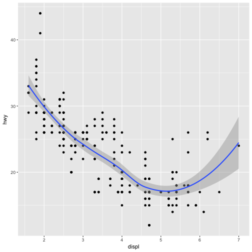


6. Recreate the R code necessary to generate the following graphs.


```r
ggplot() + geom_point(data = mpg, mapping=aes(x = displ, y = hwy)) +
  geom_smooth(mpg, mapping = aes(x=displ, y=hwy), se=FALSE)
```

```
## `geom_smooth()` using method = 'loess'
```

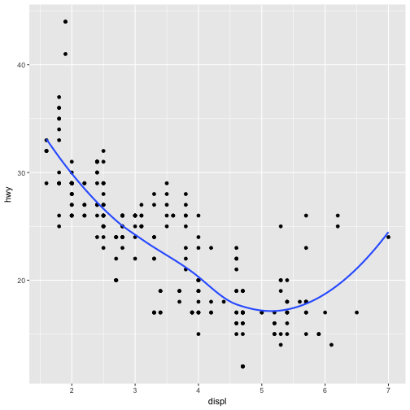


```r
ggplot() + geom_point(data = mpg, mapping=aes(x = displ, y = hwy)) +
  geom_smooth(mpg, mapping = aes(x=displ, y=hwy, group = drv), se=FALSE)
```

```
## `geom_smooth()` using method = 'loess'
```

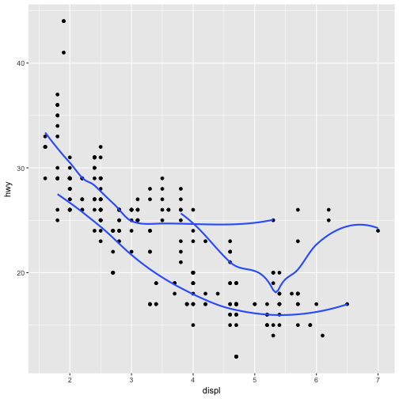


```r
ggplot() + geom_point(data = mpg, mapping=aes(x = displ, y = hwy, color = drv)) +
  geom_smooth(mpg, mapping = aes(x=displ, y=hwy, color = drv), se=FALSE)
```

```
## `geom_smooth()` using method = 'loess'
```

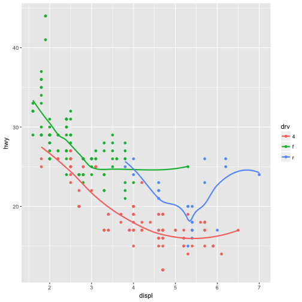


```r
ggplot() + geom_point(data = mpg, mapping=aes(x = displ, y = hwy, color=drv)) +
  geom_smooth(mpg, mapping = aes(x=displ, y=hwy), se=FALSE)
```

```
## `geom_smooth()` using method = 'loess'
```

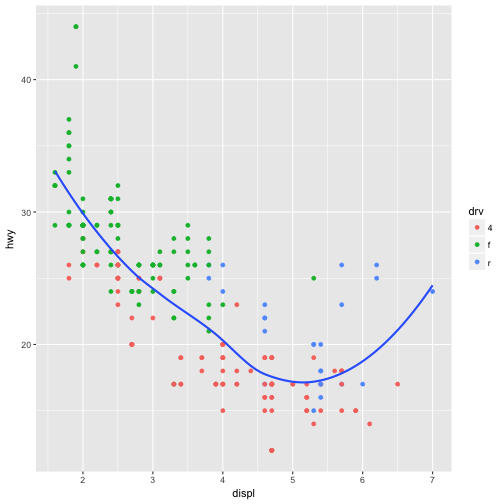


```r
ggplot() + geom_point(data = mpg, mapping=aes(x = displ, y = hwy, color=drv)) +
  geom_smooth(mpg, mapping = aes(x=displ, y=hwy, linetype=drv), se=FALSE)
```

```
## `geom_smooth()` using method = 'loess'
```

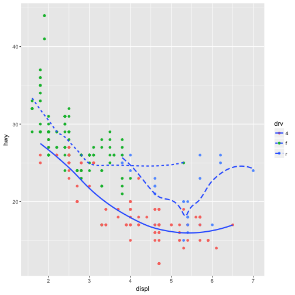


```r
ggplot() + geom_point(data = mpg, mapping = aes(x=displ, y = hwy, color=drv)) + geom_point(color="white", pch = 21, size = 5)
```

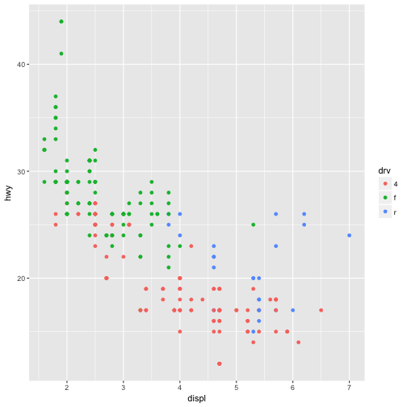


Need to put a layer of white dots first before adding the colored points by drv
White points need to be bigger than the colored points for it to show through


```r
ggplot() + geom_point(data=mpg, aes(x=displ, y=hwy), color ="white", size = 3) + geom_point(data = mpg, aes(x=displ, y = hwy, color=drv))
```


3.7

Same plots


```r
ggplot(diamonds) + stat_count(mapping = aes(x = cut))
```


```r
ggplot(diamonds) + geom_bar(mapping = aes(x=cut))
```

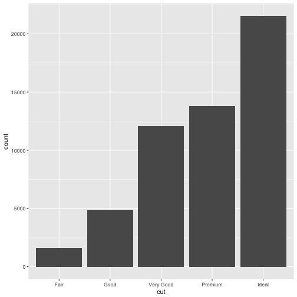


```r
ggplot(data = diamonds) + stat_summary(mapping = aes(x = cut, y = depth),
                                       fun.ymin=min,
                                       fun.ymax = max,
                                       fun.y = median)
```


####3.7.1 Exercises

1. What is the default geom associated with stat_summary()? How could you rewrite the previous plot to use that geom function instead of the stat function?


```r
stat_summary()
```

```
## geom_pointrange: na.rm = FALSE
## stat_summary: fun.data = NULL, fun.y = NULL, fun.ymax = NULL, fun.ymin = NULL, fun.args = list(), na.rm = FALSE
## position_identity
```

geom_pointrange is the default geom


```r
cut=factor(c("Fair", "Good", "Very Good", "Premium", "Ideal"))
depth_median=c(65,63.4,62.1,61.4,61.8)
depth_min=c(43,54.3, 56.8,58,43)
depth_max=c(79,67,64.9,63,66.7)

d<-data.frame(cut,depth_median,depth_min,depth_max)

ggplot(data = d, aes(x=cut, y=depth_median, ymin=depth_min, ymax=depth_max)) + geom_pointrange() + scale_x_discrete(limits=c("Fair","Good","Very Good","Premium","Ideal")) + labs(y="Depth")
```

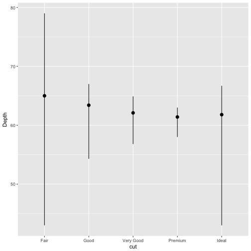

2. What does geom_col() do? How is it different to geom_bar()?


```r
?geom_col
```
height of bars to represent values, stat_identity is default
for geom_bar, stat_count is default, counts number of instances for each x

3. Most geoms and stats come in pairs that are almost always used in concert. Read through the documentation and make a list of all the pairs. What do they have in common?

geom_bar, stat_count
geom_boxplot, stat_boxplot
geom_contour, stat_contour
geom_count, stat_sum
geom_density, stat_density
geom_hex, stat_bin_hex
geom_freqpoly, stat_bin
geom_qq, stat_qq
geom_quantile, stat_quantile
geom_smooth, stat_smooth
geom_violin, stat_ydensity

They are similar in their mapping arguments.

4. What variables does stat_smooth() compute? What parameters control its behaviour?


```r
?stat_smooth
```

Computed variables: 
*y predicted value
*ymin lower pointwise confidence interval around the mean
*ymax upper pointwise confidence interval around the mean
*se standard error

Controlled by method, forumla and level

5. In our proportion bar chart, we need to set group = 1. Why? In other words what is the problem with these two graphs?


```r
ggplot(data = diamonds) + 
  geom_bar(mapping = aes(x = cut, y = ..prop.., group =1))
```

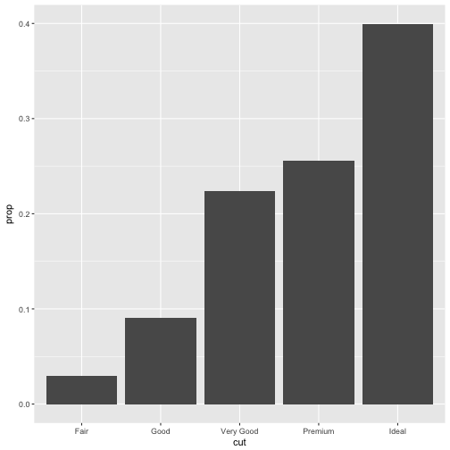

```r
ggplot(data = diamonds) + geom_bar(mapping = aes(x = cut, fill = color, y = ..prop..))
```

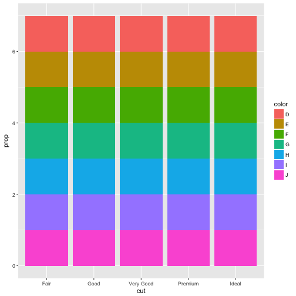

The default mapping of group is x (cut in this example) where the number of rows for each level in factor x (e.g. cut) is count separately. Setting group = 1 is to override the default setting so all levels of x are considered together.

####3.8 Position adjustments

Can color by fill instead of color


```r
ggplot(data = diamonds) + geom_bar(mapping = aes(x=cut, fill=cut))
```

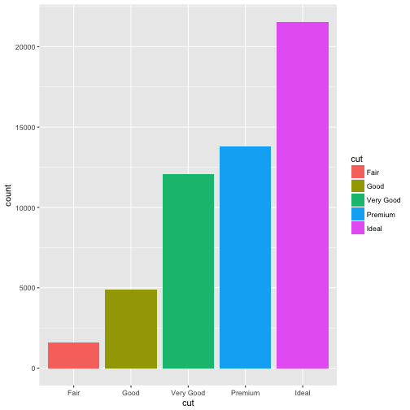

Can map fill aesthetic to another variable which makes stacked bars


```r
ggplot(data = diamonds) + geom_bar(mapping = aes(x = cut, fill = clarity))
```

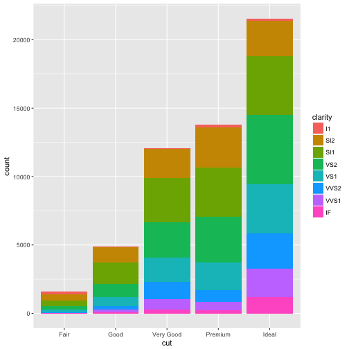

Position
identity is the actual value of object but overlapping on same bar
fill for stacked bars for proportion, each bar adds to 1.0
dodge, objects next to each other

Overplotting, points overlapping, can avoid by "jitter"
Less accurate by more revealing

####3.8.1 Exercises

1. What is the problem with this plot? How could you improve it?

Overplotting, add jitter


```r
ggplot(data = mpg, mapping = aes(x = cty, y = hwy)) + 
  geom_point()
```


```r
ggplot(data = mpg, mapping = aes(x = cty, y = hwy)) + 
  geom_point(position = "jitter")
```

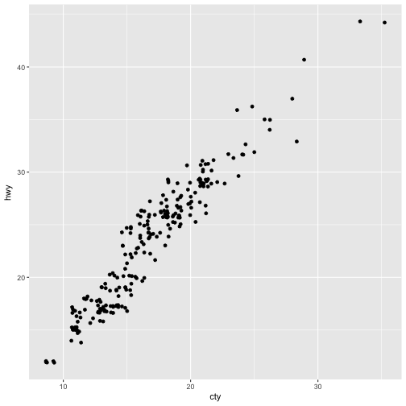


2. What parameters to geom_jitter() control the amount of jittering?

 
 ```r
 ?geom_jitter
 ```
width and height
default to 40% of the resolution of the data

3. Compare and contrast geom_jitter() with geom_count().


```r
?geom_jitter

?geom_count
```

both variants of geom_point
very similar arguments, understands the same aesthetics
geom_count position = "identity" vs geom_jitters position = "jitter"
jitter random variation in location of each point
count maps to point area


```r
ggplot(mpg, aes(cty, hwy)) +
 geom_point()
```

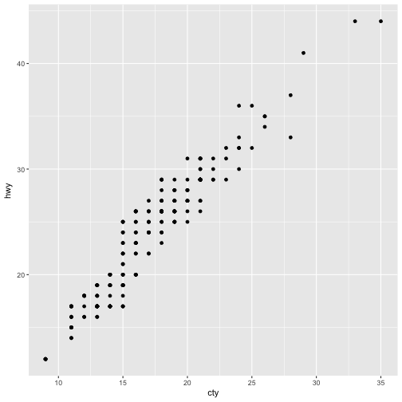

```r
ggplot(mpg, aes(cty, hwy)) +
 geom_count()
```


4. What’s the default position adjustment for geom_boxplot()? Create a visualisation of the mpg dataset that demonstrates it.

default is "dodge"


```r
ggplot(mpg, aes(x=drv, y=hwy)) + geom_boxplot(aes(fill=trans))
```

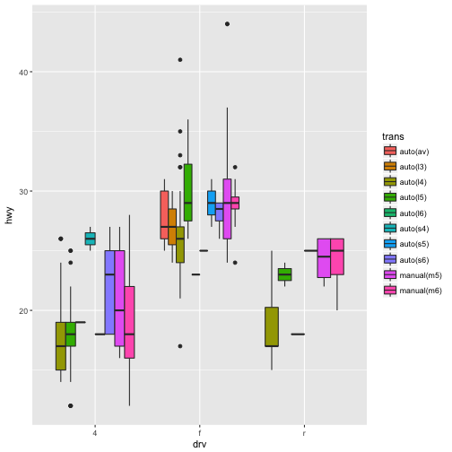

####3.9 Coordinate Systems

`coord_flip() switch x and y`

####3.9.1 Exercises

1. Turn a stacked bar chart into a pie chart using coord_polar().


```r
ggplot(data = diamonds) + 
  geom_bar(mapping = aes(x = cut, fill = clarity)) + coord_polar() + labs(x=NULL, y=NULL)
```

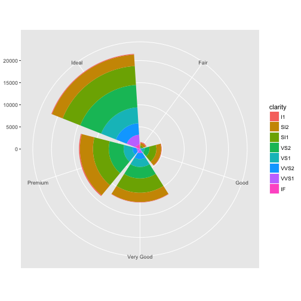

2. What does labs() do? Read the documentation.

Modify axis, legends and plot labels

3. What’s the difference between coord_quickmap() and coord_map()?

coord_quickmap preserves straight lines and coord_map don't since the projection of the earth portion is spherical.

Coord_quickmap sets the aspect ratio of the plot to the appropriate latitude and longitude ratio to approximate the usual mercator projection

4. What does the plot below tell you about the relationship between city and highway mpg? Why is coord_fixed() important? What does geom_abline() do?


```r
ggplot(data = mpg, mapping = aes(x = cty, y = hwy)) +
  geom_point() + 
  geom_abline() +
  coord_fixed()
```

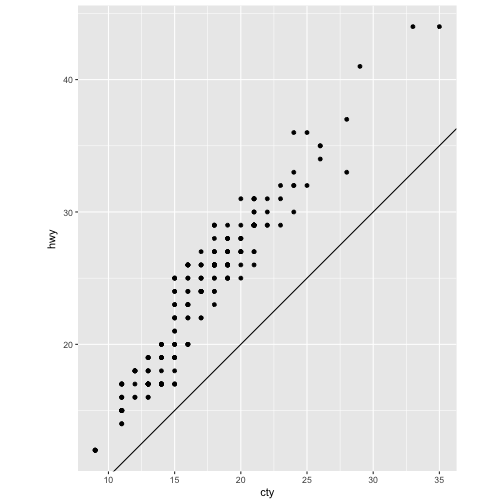

There's a positive linear relationship between cty and hwy. Coord_fix is important so that the scales on x and y axes are the same. The geom_abline adds reference lines. 

####Own data


```r
y1h<-gdata::read.xls("~/Desktop/TF_families/tca_y1h_network.xls", header = T)

ggplot(data = y1h, aes(x = complex)) + geom_bar(aes(fill=Location))
```

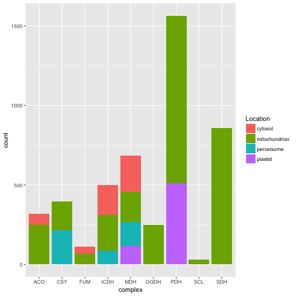

