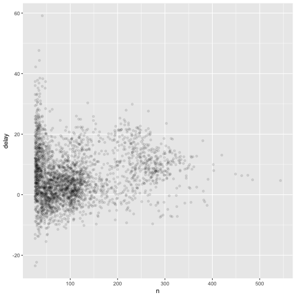

For May 17, we'll finish the 'Data transformation' sections (group summaries and group mutates) and the very brief 'Workflow: scripts' chapter.'

### 5.6

Grouped summaries with summarise()

Pair it with group_by() is more useful


```r
summarise(flights, delay = mean(dep_delay, na.rm = TRUE))
```

```
## # A tibble: 1 × 1
##      delay
##      <dbl>
## 1 12.63907
```

```r
by_day <- group_by(flights, year, month, day)
summarise(by_day, delay = mean(dep_delay, na.rm = TRUE))
```

```
## Source: local data frame [365 x 4]
## Groups: year, month [?]
## 
##     year month   day     delay
##    <int> <int> <int>     <dbl>
## 1   2013     1     1 11.548926
## 2   2013     1     2 13.858824
## 3   2013     1     3 10.987832
## 4   2013     1     4  8.951595
## 5   2013     1     5  5.732218
## 6   2013     1     6  7.148014
## 7   2013     1     7  5.417204
## 8   2013     1     8  2.553073
## 9   2013     1     9  2.276477
## 10  2013     1    10  2.844995
## # ... with 355 more rows
```

Combining multiple operations with pipe


```r
#code you might write with dplyr (which is now part of tidyverse)
by_dest <- group_by(flights, dest)
delay <- summarise(by_dest,
  count = n(),
  dist = mean(distance, na.rm = TRUE),
  delay = mean(arr_delay, na.rm = TRUE)
)
delay <- filter(delay, count > 20, dest != "HNL")

# It looks like delays increase with distance up to ~750 miles 
# and then decrease. Maybe as flights get longer there's more 
# ability to make up delays in the air?
ggplot(data = delay, mapping = aes(x = dist, y = delay)) +
  geom_point(aes(size = count), alpha = 1/3) +
  geom_smooth(se = FALSE)
```

```
## `geom_smooth()` using method = 'loess'
```


```r
#example using pipe "%>%"

delays <- flights %>% 
  group_by(dest) %>% 
  summarise(
    count = n(),
    dist = mean(distance, na.rm = TRUE),
    delay = mean(arr_delay, na.rm = TRUE)
  ) %>% 
  filter(count > 20, dest != "HNL")
```


```r
#Are they the same?
delays == delay
```

```
##       dest count dist delay
##  [1,] TRUE  TRUE TRUE  TRUE
##  [2,] TRUE  TRUE TRUE  TRUE
##  [3,] TRUE  TRUE TRUE  TRUE
##  [4,] TRUE  TRUE TRUE  TRUE
##  [5,] TRUE  TRUE TRUE  TRUE
##  [6,] TRUE  TRUE TRUE  TRUE
##  [7,] TRUE  TRUE TRUE  TRUE
##  [8,] TRUE  TRUE TRUE  TRUE
##  [9,] TRUE  TRUE TRUE  TRUE
## [10,] TRUE  TRUE TRUE  TRUE
## [11,] TRUE  TRUE TRUE  TRUE
## [12,] TRUE  TRUE TRUE  TRUE
## [13,] TRUE  TRUE TRUE  TRUE
## [14,] TRUE  TRUE TRUE  TRUE
## [15,] TRUE  TRUE TRUE  TRUE
## [16,] TRUE  TRUE TRUE  TRUE
## [17,] TRUE  TRUE TRUE  TRUE
## [18,] TRUE  TRUE TRUE  TRUE
## [19,] TRUE  TRUE TRUE  TRUE
## [20,] TRUE  TRUE TRUE  TRUE
## [21,] TRUE  TRUE TRUE  TRUE
## [22,] TRUE  TRUE TRUE  TRUE
## [23,] TRUE  TRUE TRUE  TRUE
## [24,] TRUE  TRUE TRUE  TRUE
## [25,] TRUE  TRUE TRUE  TRUE
## [26,] TRUE  TRUE TRUE  TRUE
## [27,] TRUE  TRUE TRUE  TRUE
## [28,] TRUE  TRUE TRUE  TRUE
## [29,] TRUE  TRUE TRUE  TRUE
## [30,] TRUE  TRUE TRUE  TRUE
## [31,] TRUE  TRUE TRUE  TRUE
## [32,] TRUE  TRUE TRUE  TRUE
## [33,] TRUE  TRUE TRUE  TRUE
## [34,] TRUE  TRUE TRUE  TRUE
## [35,] TRUE  TRUE TRUE  TRUE
## [36,] TRUE  TRUE TRUE  TRUE
## [37,] TRUE  TRUE TRUE  TRUE
## [38,] TRUE  TRUE TRUE  TRUE
## [39,] TRUE  TRUE TRUE  TRUE
## [40,] TRUE  TRUE TRUE  TRUE
## [41,] TRUE  TRUE TRUE  TRUE
## [42,] TRUE  TRUE TRUE  TRUE
## [43,] TRUE  TRUE TRUE  TRUE
## [44,] TRUE  TRUE TRUE  TRUE
## [45,] TRUE  TRUE TRUE  TRUE
## [46,] TRUE  TRUE TRUE  TRUE
## [47,] TRUE  TRUE TRUE  TRUE
## [48,] TRUE  TRUE TRUE  TRUE
## [49,] TRUE  TRUE TRUE  TRUE
## [50,] TRUE  TRUE TRUE  TRUE
## [51,] TRUE  TRUE TRUE  TRUE
## [52,] TRUE  TRUE TRUE  TRUE
## [53,] TRUE  TRUE TRUE  TRUE
## [54,] TRUE  TRUE TRUE  TRUE
## [55,] TRUE  TRUE TRUE  TRUE
## [56,] TRUE  TRUE TRUE  TRUE
## [57,] TRUE  TRUE TRUE  TRUE
## [58,] TRUE  TRUE TRUE  TRUE
## [59,] TRUE  TRUE TRUE  TRUE
## [60,] TRUE  TRUE TRUE  TRUE
## [61,] TRUE  TRUE TRUE  TRUE
## [62,] TRUE  TRUE TRUE  TRUE
## [63,] TRUE  TRUE TRUE  TRUE
## [64,] TRUE  TRUE TRUE  TRUE
## [65,] TRUE  TRUE TRUE  TRUE
## [66,] TRUE  TRUE TRUE  TRUE
## [67,] TRUE  TRUE TRUE  TRUE
## [68,] TRUE  TRUE TRUE  TRUE
## [69,] TRUE  TRUE TRUE  TRUE
## [70,] TRUE  TRUE TRUE  TRUE
## [71,] TRUE  TRUE TRUE  TRUE
## [72,] TRUE  TRUE TRUE  TRUE
## [73,] TRUE  TRUE TRUE  TRUE
## [74,] TRUE  TRUE TRUE  TRUE
## [75,] TRUE  TRUE TRUE  TRUE
## [76,] TRUE  TRUE TRUE  TRUE
## [77,] TRUE  TRUE TRUE  TRUE
## [78,] TRUE  TRUE TRUE  TRUE
## [79,] TRUE  TRUE TRUE  TRUE
## [80,] TRUE  TRUE TRUE  TRUE
## [81,] TRUE  TRUE TRUE  TRUE
## [82,] TRUE  TRUE TRUE  TRUE
## [83,] TRUE  TRUE TRUE  TRUE
## [84,] TRUE  TRUE TRUE  TRUE
## [85,] TRUE  TRUE TRUE  TRUE
## [86,] TRUE  TRUE TRUE  TRUE
## [87,] TRUE  TRUE TRUE  TRUE
## [88,] TRUE  TRUE TRUE  TRUE
## [89,] TRUE  TRUE TRUE  TRUE
## [90,] TRUE  TRUE TRUE  TRUE
## [91,] TRUE  TRUE TRUE  TRUE
## [92,] TRUE  TRUE TRUE  TRUE
## [93,] TRUE  TRUE TRUE  TRUE
## [94,] TRUE  TRUE TRUE  TRUE
## [95,] TRUE  TRUE TRUE  TRUE
## [96,] TRUE  TRUE TRUE  TRUE
```

```r
#Yes
```

Missing values

Use na.rm = True to remove missing values before computation

Available wtih all aggregation functions

Get a count of non-missing values sum(!(is.na(x)))


```r
not_cancelled <- flights %>% 
  filter(!is.na(dep_delay), !is.na(arr_delay))

not_cancelled %>% 
  group_by(year, month, day) %>% 
  summarise(mean = mean(dep_delay))
```

```
## Source: local data frame [365 x 4]
## Groups: year, month [?]
## 
##     year month   day      mean
##    <int> <int> <int>     <dbl>
## 1   2013     1     1 11.435620
## 2   2013     1     2 13.677802
## 3   2013     1     3 10.907778
## 4   2013     1     4  8.965859
## 5   2013     1     5  5.732218
## 6   2013     1     6  7.145959
## 7   2013     1     7  5.417204
## 8   2013     1     8  2.558296
## 9   2013     1     9  2.301232
## 10  2013     1    10  2.844995
## # ... with 355 more rows
```

```r
delays <- not_cancelled %>% 
  group_by(tailnum) %>% 
  summarise(
    delay = mean(arr_delay)
  )

ggplot(data = delays, mapping = aes(x = delay)) + 
  geom_freqpoly(binwidth = 10)
```


```r
delays <- not_cancelled %>% 
  group_by(tailnum) %>% 
  summarise(
    delay = mean(arr_delay, na.rm = TRUE),
    n = n()
  )

ggplot(data = delays, mapping = aes(x = n, y = delay)) + 
  geom_point(alpha = 1/10)
```


```r
delays %>% 
  filter(n > 25) %>% 
  ggplot(mapping = aes(x = n, y = delay)) + 
    geom_point(alpha = 1/10)
```




```r
#install.packages("Lahman")
#library(Lahman)
batting <- as_tibble(Lahman::Batting)

batters <- batting %>% 
  group_by(playerID) %>% 
  summarise(
    ba = sum(H, na.rm = TRUE) / sum(AB, na.rm = TRUE),
    ab = sum(AB, na.rm = TRUE)
  )

batters %>% 
  filter(ab > 100) %>% 
  ggplot(mapping = aes(x = ab, y = ba)) +
    geom_point() + 
    geom_smooth(se = FALSE)
```

```
## `geom_smooth()` using method = 'gam'
```


```r
batters %>% arrange(desc(ba))
```

```
## # A tibble: 18,659 × 3
##     playerID    ba    ab
##        <chr> <dbl> <int>
## 1  abramge01     1     1
## 2  banisje01     1     1
## 3  bartocl01     1     1
## 4   bassdo01     1     1
## 5  birasst01     1     2
## 6  bruneju01     1     1
## 7  burnscb01     1     1
## 8  cammaer01     1     1
## 9   campsh01     1     1
## 10 crockcl01     1     1
## # ... with 18,649 more rows
```

Useful summary functions

**Measure of spread: sd(x), IQR(x), mad(x)**

IQR() interquartile range

mad(x) median absolute deviation

**Measure of rank: min(x), quantile(x, 0.25), max(x)**

quantile(x, 0.25) find values of x that is greater than 25%5 of the values and less thn the remaining 75%

**Measures of position: first(x), nth(x,2), last(x)**

similar to subset, e.g. x[1], x[length(x)]


```r
daily <- group_by(flights, year, month, day)
(per_day   <- summarise(daily, flights = n()))
```

```
## Source: local data frame [365 x 4]
## Groups: year, month [?]
## 
##     year month   day flights
##    <int> <int> <int>   <int>
## 1   2013     1     1     842
## 2   2013     1     2     943
## 3   2013     1     3     914
## 4   2013     1     4     915
## 5   2013     1     5     720
## 6   2013     1     6     832
## 7   2013     1     7     933
## 8   2013     1     8     899
## 9   2013     1     9     902
## 10  2013     1    10     932
## # ... with 355 more rows
```

```r
per_month <- summarise(per_day, flights = sum(flights))
per_year  <- summarise(per_month, flights = sum(flights))
```


### 5.6.7 Exercises

1. Brainstorm at least 5 different ways to assess the typical delay characteristics of a group of flights. Consider the following scenarios:

A flight is 15 minutes early 50% of the time, and 15 minutes late 50% of the time.

A flight is always 10 minutes late.

A flight is 30 minutes early 50% of the time, and 30 minutes late 50% of the time.

99% of the time a flight is on time. 1% of the time it’s 2 hours late.

Which is more important: arrival delay or departure delay?

Mean of delay time, median of delay time, spread (sd) of delay time, how flights rank in terms of delay time, .

2. Come up with another approach that will give you the same output as not_cancelled %>% count(dest) and not_cancelled %>% count(tailnum, wt = distance) (without using count()).


```r
not_cancelled %>% count(dest)
```

```
## # A tibble: 104 × 2
##     dest     n
##    <chr> <int>
## 1    ABQ   254
## 2    ACK   264
## 3    ALB   418
## 4    ANC     8
## 5    ATL 16837
## 6    AUS  2411
## 7    AVL   261
## 8    BDL   412
## 9    BGR   358
## 10   BHM   269
## # ... with 94 more rows
```

```r
not_cancelled %>% group_by(dest) %>% summarise(n=n())
```

```
## # A tibble: 104 × 2
##     dest     n
##    <chr> <int>
## 1    ABQ   254
## 2    ACK   264
## 3    ALB   418
## 4    ANC     8
## 5    ATL 16837
## 6    AUS  2411
## 7    AVL   261
## 8    BDL   412
## 9    BGR   358
## 10   BHM   269
## # ... with 94 more rows
```

```r
not_cancelled %>% count(tailnum, wt = distance)
```

```
## # A tibble: 4,037 × 2
##    tailnum      n
##      <chr>  <dbl>
## 1   D942DN   3418
## 2   N0EGMQ 239143
## 3   N10156 109664
## 4   N102UW  25722
## 5   N103US  24619
## 6   N104UW  24616
## 7   N10575 139903
## 8   N105UW  23618
## 9   N107US  21677
## 10  N108UW  32070
## # ... with 4,027 more rows
```

```r
not_cancelled %>% group_by(tailnum) %>% summarise(wt = sum(distance))
```

```
## # A tibble: 4,037 × 2
##    tailnum     wt
##      <chr>  <dbl>
## 1   D942DN   3418
## 2   N0EGMQ 239143
## 3   N10156 109664
## 4   N102UW  25722
## 5   N103US  24619
## 6   N104UW  24616
## 7   N10575 139903
## 8   N105UW  23618
## 9   N107US  21677
## 10  N108UW  32070
## # ... with 4,027 more rows
```


3. Our definition of cancelled flights (is.na(dep_delay) | is.na(arr_delay) ) is slightly suboptimal. Why? Which is the most important column?

Longer to type. Could easily indicate cancelled flights as is.na(air_time)

4. Look at the number of cancelled flights per day. Is there a pattern? Is the proportion of cancelled flights related to the average delay?


```r
cancel<-flights %>% group_by(month, day) %>% count()

ggplot(cancel, mapping = aes(day, n)) + geom_point()
```


```r
canceldelay <- flights %>% mutate(cancelled = (is.na(air_time))) %>% group_by(month, day) %>% summarise(cancel = mean(cancelled), avg_delay = mean(dep_delay, na.rm = T))

ggplot(canceldelay, aes(avg_delay, cancel)) + geom_point() + geom_smooth()
```

```
## `geom_smooth()` using method = 'loess'
```


Weak positive relationship

5. Which carrier has the worst delays? Challenge: can you disentangle the effects of bad airports vs. bad carriers? Why/why not? (Hint: think about flights %>% group_by(carrier, dest) %>% summarise(n()))


```r
flights %>% group_by(carrier, dest) %>% summarise(n())
```

```
## Source: local data frame [314 x 3]
## Groups: carrier [?]
## 
##    carrier  dest `n()`
##     <fctr> <chr> <int>
## 1       9E   ATL    59
## 2       9E   AUS     2
## 3       9E   AVL    10
## 4       9E   BGR     1
## 5       9E   BNA   474
## 6       9E   BOS   914
## 7       9E   BTV     2
## 8       9E   BUF   833
## 9       9E   BWI   856
## 10      9E   CAE     3
## # ... with 304 more rows
```

```r
flights %>% group_by(carrier, dest) %>% summarise(dep=mean(dep_delay), arr=mean(arr_delay)) %>% arrange(desc(arr))
```

```
## Source: local data frame [314 x 4]
## Groups: carrier [16]
## 
##    carrier  dest      dep       arr
##     <fctr> <chr>    <dbl>     <dbl>
## 1       UA   STL 77.50000 110.00000
## 2       OO   ORD 67.00000 107.00000
## 3       OO   DTW 61.00000  68.50000
## 4       UA   RDU 60.00000  56.00000
## 5       EV   PBI 48.66667  40.66667
## 6       EV   ORD 15.50000  17.50000
## 7       MQ   TVC 11.78788  14.87879
## 8       UA   CLT -2.50000  14.50000
## 9       9E   GSO -6.00000  13.00000
## 10      9E   MSN -2.00000  12.00000
## # ... with 304 more rows
```

```r
delay_carr<-flights %>%
  group_by(carrier) %>%
  summarise(dep_delay=mean(dep_delay, na.rm=T),arr_delay = mean(arr_delay, na.rm = TRUE)) %>%
  arrange(desc(arr_delay))

delay_dest<-flights %>%
  group_by(dest) %>%
  summarise(dep_delay=mean(dep_delay, na.rm=T), arr_delay = mean(arr_delay, na.rm = TRUE)) %>%
  arrange(desc(arr_delay))
```

F9 carrier has the worst delays

Can disentangle bad carrier versus bad airports by comparing avg delay by carrier versus avg delay by dest. Those averages also don't correspond to delay calculated by carrier and dest


6. What does the sort argument to count() do. When might you use it?


```r
?count
```

Sort, if true, will sort output in descending order of n. Might want to use it find max.


```r
flights %>% count(dest, sort=T)
```

```
## # A tibble: 105 × 2
##     dest     n
##    <chr> <int>
## 1    ORD 17283
## 2    ATL 17215
## 3    LAX 16174
## 4    BOS 15508
## 5    MCO 14082
## 6    CLT 14064
## 7    SFO 13331
## 8    FLL 12055
## 9    MIA 11728
## 10   DCA  9705
## # ... with 95 more rows
```


### 5.7.1 Exercises

1. Refer back to the lists of useful mutate and filtering functions. Describe how each operation changes when you combine it with grouping.

Would apply to your defined group instead of over the entire df/tibble.

2. Which plane (tailnum) has the worst on-time record?


```r
flights %>% group_by(tailnum) %>% summarise(arr_delay = mean(arr_delay, na.rm=T)) %>% arrange(desc(arr_delay))
```

```
## # A tibble: 4,044 × 2
##    tailnum arr_delay
##      <chr>     <dbl>
## 1   N844MH  320.0000
## 2   N911DA  294.0000
## 3   N922EV  276.0000
## 4   N587NW  264.0000
## 5   N851NW  219.0000
## 6   N928DN  201.0000
## 7   N7715E  188.0000
## 8   N654UA  185.0000
## 9   N665MQ  174.6667
## 10  N427SW  157.0000
## # ... with 4,034 more rows
```

N844MH worst on-time record.

3. What time of day should you fly if you want to avoid delays as much as possible?


```r
flights %>% group_by(hour) %>% summarise(arr_delay = mean(arr_delay, na.rm=T)) %>% arrange(arr_delay)
```

```
## # A tibble: 20 × 2
##     hour  arr_delay
##    <dbl>      <dbl>
## 1      7 -5.3044716
## 2      5 -4.7969072
## 3      6 -3.3844854
## 4      9 -1.4514074
## 5      8 -1.1132266
## 6     10  0.9539401
## 7     11  1.4819300
## 8     12  3.4890104
## 9     13  6.5447397
## 10    14  9.1976501
## 11    23 11.7552783
## 12    15 12.3241920
## 13    16 12.5976412
## 14    18 14.7887244
## 15    22 15.9671618
## 16    17 16.0402670
## 17    19 16.6558736
## 18    20 16.6761098
## 19    21 18.3869371
## 20     1        NaN
```

Around 7 am.

4. For each destination, compute the total minutes of delay. For each, flight, compute the proportion of the total delay for its destination.


```r
flights %>% filter(!(is.na(arr_delay))) %>% group_by(dest) %>% summarise(total = sum(arr_delay))
```

```
## # A tibble: 104 × 2
##     dest  total
##    <chr>  <dbl>
## 1    ABQ   1113
## 2    ACK   1281
## 3    ALB   6018
## 4    ANC    -20
## 5    ATL 190260
## 6    AUS  14514
## 7    AVL   2089
## 8    BDL   2904
## 9    BGR   2874
## 10   BHM   4540
## # ... with 94 more rows
```

```r
flights %>% filter(!(is.na(arr_delay))) %>% group_by(dest) %>% mutate(proportion = arr_delay/sum(arr_delay))
```

```
## Source: local data frame [327,346 x 20]
## Groups: dest [104]
## 
##     year month   day dep_time sched_dep_time dep_delay arr_time
##    <int> <int> <int>    <int>          <int>     <dbl>    <int>
## 1   2013     1     1      517            515         2      830
## 2   2013     1     1      533            529         4      850
## 3   2013     1     1      542            540         2      923
## 4   2013     1     1      544            545        -1     1004
## 5   2013     1     1      554            600        -6      812
## 6   2013     1     1      554            558        -4      740
## 7   2013     1     1      555            600        -5      913
## 8   2013     1     1      557            600        -3      709
## 9   2013     1     1      557            600        -3      838
## 10  2013     1     1      558            600        -2      753
## # ... with 327,336 more rows, and 13 more variables: sched_arr_time <int>,
## #   arr_delay <dbl>, carrier <fctr>, flight <int>, tailnum <chr>,
## #   origin <chr>, dest <chr>, air_time <dbl>, distance <dbl>, hour <dbl>,
## #   minute <dbl>, time_hour <dttm>, proportion <dbl>
```

5. Delays are typically temporally correlated: even once the problem that caused the initial delay has been resolved, later flights are delayed to allow earlier flights to leave. Using lag() explore how the delay of a flight is related to the delay of the immediately preceding flight.


```r
lag_flights<-flights %>% group_by(month, day, hour) %>% filter(!is.na(arr_delay)) %>% mutate(lag_d=lag(dep_delay))

ggplot(lag_flights, aes(dep_delay, lag_d)) + geom_point()
```

```
## Warning: Removed 6922 rows containing missing values (geom_point).
```


6. Look at each destination. Can you find flights that are suspiciously fast? (i.e. flights that represent a potential data entry error). Compute the air time a flight relative to the shortest flight to that destination. Which flights were most delayed in the air?

Some of these questions are very confusing . . . compute air time a flight relative to shortest flight to that dest??


```r
flights %>% filter(!(is.na(arr_delay))) %>% group_by(dest) %>% summarise(mean_air=mean(air_time)) %>% arrange(mean_air)
```

```
## # A tibble: 104 × 2
##     dest mean_air
##    <chr>    <dbl>
## 1    BDL 25.46602
## 2    ALB 31.78708
## 3    PVD 32.66760
## 4    PHL 33.17132
## 5    MVY 36.31905
## 6    BWI 38.49970
## 7    MHT 38.50858
## 8    BOS 38.95300
## 9    ACK 42.06818
## 10   SYR 43.03984
## # ... with 94 more rows
```

Flights to BDL, not surprising if it's in Connecticutt.


```r
flights %>% filter(!(is.na(arr_delay))) %>% group_by(dest) %>% mutate(avg_air=mean(air_time), min_air=min(air_time), fast = air_time-min_air) %>% arrange(desc(fast))
```

```
## Source: local data frame [327,346 x 22]
## Groups: dest [104]
## 
##     year month   day dep_time sched_dep_time dep_delay arr_time
##    <int> <int> <int>    <int>          <int>     <dbl>    <int>
## 1   2013     7    28     1727           1730        -3     2242
## 2   2013    11    22     1812           1815        -3     2302
## 3   2013     1    28     1806           1700        66     2253
## 4   2013     9    10     1513           1507         6     1914
## 5   2013     7    10     1814           1815        -1     2240
## 6   2013    11    22     2142           1729       253      143
## 7   2013    12     6     1727           1730        -3     2206
## 8   2013    12     7     1646           1620        26     2107
## 9   2013     3    17     1337           1335         2     1937
## 10  2013    12     6     1746           1745         1     2225
## # ... with 327,336 more rows, and 15 more variables: sched_arr_time <int>,
## #   arr_delay <dbl>, carrier <fctr>, flight <int>, tailnum <chr>,
## #   origin <chr>, dest <chr>, air_time <dbl>, distance <dbl>, hour <dbl>,
## #   minute <dbl>, time_hour <dttm>, avg_air <dbl>, min_air <dbl>,
## #   fast <dbl>
```


7. Find all destinations that are flown by at least two carriers. Use that information to rank the carriers.


```r
flights %>% group_by(dest) %>% count(carrier) %>% group_by(dest) %>% summarise(num_carrier=n()) %>% filter(num_carrier >= 2)
```

```
## # A tibble: 76 × 2
##     dest num_carrier
##    <chr>       <int>
## 1    ATL           7
## 2    AUS           6
## 3    AVL           2
## 4    BDL           2
## 5    BGR           2
## 6    BNA           5
## 7    BOS           7
## 8    BQN           2
## 9    BTV           3
## 10   BUF           4
## # ... with 66 more rows
```


8. For each plane, count the number of flights before the first delay of greater than 1 hour.


```r
flights %>% arrange(month, day, tailnum) %>% group_by(tailnum) %>% mutate(hourlate = dep_delay > 60) %>% mutate(beforedelay = cumsum(hourlate)) %>% filter(beforedelay > 1) %>% count()
```

```
## # A tibble: 2,238 × 2
##    tailnum     n
##      <chr> <int>
## 1   N10156    13
## 2   N102UW     9
## 3   N104UW    35
## 4   N108UW     2
## 5   N11106    60
## 6   N11107     6
## 7   N11109     3
## 8   N11113    13
## 9   N11119     5
## 10  N11121    12
## # ... with 2,228 more rows
```

### 6.3 

1. Go to the RStudio Tips twitter account, https://twitter.com/rstudiotips and find one tip that looks interesting. Practice using it!

code snippets: https://rviews.rstudio.com/2017/03/03/february-17-tips-and-tricks/


```r
#template for r function is fun + Tab
name <- function(variables) {
  
}
```


2. What other common mistakes will RStudio diagnostics report? Read https://support.rstudio.com/hc/en-us/articles/205753617-Code-Diagnostics to find out.

Missing argument

If variable not in scope

If variable is defined but not used
