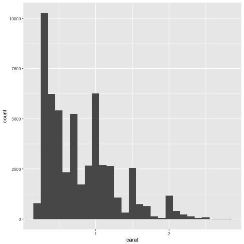

### 7.2 Questions

Two types of questions:

1. What type of variation occurs within my variables?

2. What type of covariation occurs between my variables?

**Useful terms:**

* A __variable__ is a quantity, quality, or property that you can measure.

* A __value__ is the state of a variable when you measure it. The value of a variable may change from measurement to measurement.

* An __observation__ is a set of measurements made under similar conditions (you usually make all of the measurements in an observation at the same time and on the same object). An observation will contain several values, each associated with a different variable. I’ll sometimes refer to an observation as a data point.

* __Tabular data__ is a set of values, each associated with a variable and an observation. Tabular data is tidy if each value is placed in its own “cell”, each variable in its own column, and each observation in its own row.

## 7.3 Variation

Example of variation in categorical variable


```r
ggplot(data = diamonds) +
  geom_bar(mapping = aes(x = cut))
```


```r
#to "manually" count numbers by category using dplyr

diamonds %>% 
  count(cut)
```

```
## # A tibble: 5 × 2
##         cut     n
##       <ord> <int>
## 1      Fair  1610
## 2      Good  4906
## 3 Very Good 12082
## 4   Premium 13791
## 5     Ideal 21551
```


Example for continuous variable


```r
ggplot(data = diamonds) +
  geom_histogram(mapping = aes(x = carat), binwidth = 0.5)
```


```r
# to compute by hand, combining dplyr and ggplot::cut_width()
# cut_width to set bin

diamonds %>% 
  count(cut_width(carat, 0.5)) #here, each bin is multiple of 0.5
```

```
## # A tibble: 11 × 2
##    `cut_width(carat, 0.5)`     n
##                     <fctr> <int>
## 1             [-0.25,0.25]   785
## 2              (0.25,0.75] 29498
## 3              (0.75,1.25] 15977
## 4              (1.25,1.75]  5313
## 5              (1.75,2.25]  2002
## 6              (2.25,2.75]   322
## 7              (2.75,3.25]    32
## 8              (3.25,3.75]     5
## 9              (3.75,4.25]     4
## 10             (4.25,4.75]     1
## 11             (4.75,5.25]     1
```


Zooming in at data for carat of less than 3

Set width of histogram with binwidth


```r
smaller <- diamonds %>% 
  filter(carat < 3)
  
ggplot(data = smaller, mapping = aes(x = carat)) +
  geom_histogram(binwidth = 0.1)
```



geom_freqpoly() is better for overlaying multiple histogram


```r
ggplot(data = smaller, mapping = aes(x = carat, colour = cut)) +
  geom_freqpoly(binwidth = 0.1)
```


```r
ggplot(data = faithful, mapping = aes(x = eruptions)) + 
  geom_histogram(binwidth = 0.25)
```


Outliers


```r
ggplot(diamonds) + 
  geom_histogram(mapping = aes(x = y), binwidth = 0.5)
```


Zoom in on short bars. Coord_cartesian for xlim and ylim


```r
ggplot(diamonds) + 
  geom_histogram(mapping = aes(x = y), binwidth = 0.5) +
  coord_cartesian(ylim = c(0, 50))
```


## 7.3.4 Exercises

1. Explore the distribution of each of the x, y, and z variables in diamonds. What do you learn? Think about a diamond and how you might decide which dimension is the length, width, and depth.


```r
ggplot(data = diamonds, mapping = aes(x = x)) +
  geom_histogram(binwidth = 0.1)
```


```r
ggplot(data = diamonds, mapping = aes(x = y)) +
  geom_histogram(binwidth = 0.1)
```


```r
ggplot(data = diamonds, mapping = aes(x = z)) +
  geom_histogram(binwidth = 0.1)
```


I don't know anything about diamonds. X and Z are the shortest, so either one of those would be depth with the except of the outliers. Y could be length.

2. Explore the distribution of price. Do you discover anything unusual or surprising? (Hint: Carefully think about the binwidth and make sure you try a wide range of values.)


```r
ggplot(diamonds, aes(price)) + geom_histogram(binwidth = 100)
```


```r
ggplot(diamonds, aes(price)) + geom_histogram(binwidth = 1000)
```


```r
ggplot(diamonds, aes(price)) + geom_histogram(binwidth = 100) + coord_cartesian(xlim = c(0,5000))
```


Why are diamonds so expensive? Just compressed carbon. There are very few diamonds that are $1500.

3. How many diamonds are 0.99 carat? How many are 1 carat? What do you think is the cause of the difference?


```r
ggplot(diamonds, aes(carat)) + geom_histogram(binwidth = 0.01) + coord_cartesian(xlim = c(0,1))
```


```r
diamonds %>% filter(carat==0.99) %>% count()
```

```
## # A tibble: 1 × 1
##       n
##   <int>
## 1    23
```

```r
diamonds %>% filter(carat==1) %>% count()
```

```
## # A tibble: 1 × 1
##       n
##   <int>
## 1  1558
```

23 diamonds that are 0.99 carats versus 1558 diamonds that are 1 carat. I think it's because they rather sell 1 carat than to market diamonds at 0.99. Doesn't seem to relate to price since I don't see a big jump in price between less 1 and more than 1 carat.


```r
ggplot(diamonds, aes(carat, price)) + geom_point()
```


4. Compare and contrast coord_cartesian() vs xlim() or ylim() when zooming in on a histogram. What happens if you leave binwidth unset? What happens if you try and zoom so only half a bar shows?

If bindwidth is unset, default to use bin that cover the range of data, default to 30.

(coord_cartesian() also has an xlim() argument for when you need to zoom into the x-axis. ggplot2 also has xlim() and ylim() functions that work slightly differently: they throw away the data outside the limits.)


```r
ggplot(diamonds, aes(carat)) + geom_histogram()
```

```
## `stat_bin()` using `bins = 30`. Pick better value with `binwidth`.
```


```r
ggplot(diamonds, aes(carat)) + geom_histogram(binwidth = 0.5) + coord_cartesian(xlim = c(0, 2.1))
```


```r
ggplot(diamonds, aes(carat)) + geom_histogram() + xlim(c(0,2.1))
```

```
## `stat_bin()` using `bins = 30`. Pick better value with `binwidth`.
```

```
## Warning: Removed 749 rows containing non-finite values (stat_bin).
```

```
## Warning: Removed 1 rows containing missing values (geom_bar).
```


## 7.4 Missing values

If unusal data, don't drop that entire row. Convert to missing values, NA


```r
diamonds2 <- diamonds %>% 
  mutate(y = ifelse(y < 3 | y > 20, NA, y))
```

ggplot warns if rows have been removed


```r
ggplot(data = diamonds2, mapping = aes(x = x, y = y)) + 
  geom_point()
```

```
## Warning: Removed 9 rows containing missing values (geom_point).
```


```r
nycflights13::flights %>% 
  mutate(
    cancelled = is.na(dep_time), #new column for if cancelled or not
    sched_hour = sched_dep_time %/% 100,
    sched_min = sched_dep_time %% 100,
    sched_dep_time = sched_hour + sched_min / 60
  ) %>% 
  ggplot(mapping = aes(sched_dep_time)) + 
    geom_freqpoly(mapping = aes(colour = cancelled), binwidth = 1/4)
```


## 7.4.1 Exercises

1. What happens to missing values in a histogram? What happens to missing values in a bar chart? Why is there a difference?


```r
library(nycflights13)

ggplot(flights, aes(dep_time)) + geom_histogram()
```

```
## `stat_bin()` using `bins = 30`. Pick better value with `binwidth`.
```

```
## Warning: Removed 8255 rows containing non-finite values (stat_bin).
```


```r
ggplot(flights, aes(dep_time)) + geom_bar()
```

```
## Warning: Removed 8255 rows containing non-finite values (stat_count).
```


Both methods removed same number of rows containing non-finite numbers. Difference in stat_bin vs stat_count. Is there a difference??

2. What does na.rm = TRUE do in mean() and sum()?


```r
?mean()

#na.rm a logical value indication whether NA should be stripped

?sum()

#na.rm logical. Should missing values (indlucing NaN) be removed?
```

It means remove NA.

## 7.5 Covariation

Covariation is the tendency for the values of two or more variables to vary together in a related way


```r
ggplot(data = diamonds, mapping = aes(x = price)) + 
  geom_freqpoly(mapping = aes(colour = cut), binwidth = 500)
```


```r
ggplot(data = diamonds, mapping = aes(x = price, y = ..density..)) + 
  geom_freqpoly(mapping = aes(colour = cut), binwidth = 500)
```


Boxplots


```r
ggplot(data = diamonds, mapping = aes(x = cut, y = price)) +
  geom_boxplot()
```


Categorical don't have intrinsic order so can set order with reorder() function


```r
ggplot(data = mpg, mapping = aes(x = class, y = hwy)) +
  geom_boxplot()
```


```r
#reorder class
ggplot(data = mpg) +
  geom_boxplot(mapping = aes(x = reorder(class, hwy, FUN = median), y = hwy))
```


```r
#flip if long variable names

ggplot(data = mpg) +
  geom_boxplot(mapping = aes(x = reorder(class, hwy, FUN = median), y = hwy)) +
  coord_flip()
```


## 7.5.1.1 Exercises

1. Use what you’ve learned to improve the visualisation of the departure times of cancelled vs. non-cancelled flights.


```r
flights2<-nycflights13::flights %>% 
  mutate(
    cancelled = is.na(dep_time), #new column for if cancelled or not
    sched_hour = sched_dep_time %/% 100,
    sched_min = sched_dep_time %% 100,
    sched_dep_time = sched_hour + sched_min / 60)
```


```r
 ggplot(flights2, mapping = aes(sched_dep_time, y = ..density..)) + 
    geom_freqpoly(mapping = aes(colour = cancelled), binwidth = 1/4)
```


2. What variable in the diamonds dataset is most important for predicting the price of a diamond? How is that variable correlated with cut? Why does the combination of those two relationships lead to lower quality diamonds being more expensive?


```r
ggplot(diamonds, aes(clarity,price)) + geom_boxplot()
```


```r
ggplot(diamonds, aes(carat, price)) + geom_point()
```


```r
ggplot(diamonds, aes(cut, price)) + geom_boxplot()
```


```r
ggplot(diamonds, aes(color, price)) + geom_boxplot()
```


```r
ggplot(diamonds, aes(depth, price)) + geom_point()
```


```r
ggplot(diamonds, aes(table, price)) + geom_point()
```


Color.


```r
ggplot(diamonds, aes(color, price, color=cut)) + geom_boxplot()
```


Clarity


```r
ggplot(diamonds, aes(clarity, price, color=cut)) + geom_boxplot()
```


If lower grade has better cuts. But data could be misleading if you're looking at the outliers. More outliers in the better quality?

3. Install the ggstance package, and create a horizontal boxplot. How does this compare to using coord_flip()?


```
ggplot(mpg, aes(class, hwy, fill = factor(cyl))) +
  ggstance::geom_boxplot() +
  coord_flip()

ggplot(mpg, aes(hwy, class, fill = factor(cyl))) +
  ggstance::geom_boxploth()
```

The position of the arguments for mapping is different. The legend for grouping changes position.

4. One problem with boxplots is that they were developed in an era of much smaller datasets and tend to display a prohibitively large number of “outlying values”. One approach to remedy this problem is the letter value plot. Install the lvplot package, and try using geom_lv() to display the distribution of price vs cut. What do you learn? How do you interpret the plots?

```
install.packages("lvplot", type = "source")
library(lvplot)
```
```
ggplot(diamonds, aes(x = cut, y = price)) +
  geom_lv()
```


This reminds me more of a violin plot but the distributions look very similar between cuts.

Tails as letter values, outliers as are observations beyond most extreme letter value.

5. Compare and contrast geom_violin() with a facetted geom_histogram(), or a coloured geom_freqpoly(). What are the pros and cons of each method?


```r
ggplot(diamonds, aes(cut, price)) + geom_violin()
```


```r
ggplot(diamonds, aes(price)) + geom_histogram() + facet_grid(~cut)
```

```
## `stat_bin()` using `bins = 30`. Pick better value with `binwidth`.
```


```r
ggplot(diamonds, aes(price)) + geom_freqpoly(aes(color=cut)) 
```

```
## `stat_bin()` using `bins = 30`. Pick better value with `binwidth`.
```


Violin plot and geom_freqpolu show distribution of price all on one plot with smoothing. The faceted geomhistogram shows more discrete bins. It's easier to compare using geomfreqpoly and faceted geomhistogram. For the violin plots, the breakdown of price range are relative.

5. If you have a small dataset, it’s sometimes useful to use geom_jitter() to see the relationship between a continuous and categorical variable. The ggbeeswarm package provides a number of methods similar to geom_jitter(). List them and briefly describe what each one does.

geom_quasirandom, space dots to avoid overplotting using van der Corput sequence or Tukey texturing

geom_beeswarm, uses beeswarm library to do point-size based offset

## 7.5.2


```r
ggplot(data = diamonds) +
  geom_count(mapping = aes(x = cut, y = color))
```


```r
diamonds %>% 
  count(color, cut) %>%  
  ggplot(mapping = aes(x = color, y = cut)) +
    geom_tile(mapping = aes(fill = n))
```


## 7.5.2.1 Exercises

1. How could you rescale the count dataset above to more clearly show the distribution of cut within colour, or colour within cut?


```r
#from jrnold
diamonddis <- diamonds %>% count(color, cut) %>% group_by(color) %>% mutate(p_color = n/sum(n)) %>% ungroup() %>% group_by(cut) %>% mutate(p_cut = n/sum(n))

ggplot(diamonddis, aes(color,cut)) + geom_tile(mapping=aes(fill=p_color))
```


```r
ggplot(diamonddis, aes(color, cut)) + geom_tile(mapping = aes(fill=p_cut))
```


2. Use geom_tile() together with dplyr to explore how average flight delays vary by destination and month of year. What makes the plot difficult to read? How could you improve it?


```r
flights %>% group_by(dest, month) %>% summarise(avg_delay = mean(dep_delay)) %>% ggplot(aes(dest, month)) + geom_tile(aes(fill=avg_delay)) + theme(axis.text.x = element_text(angle = 90)) + ylim(1,12)
```


Too many destinations. Too many missing values.

Remove missing values. Should probably scale the dep_deplay time for comparison across dest or months.

3. Why is it slightly better to use aes(x = color, y = cut) rather than aes(x = cut, y = color) in the example above?


```r
ggplot(data = diamonds) + geom_count(mapping = aes(x = cut, y = color))
```


```r
ggplot(data = diamonds) + geom_count(mapping = aes(x = color, y = cut))
```


Actually don't know and don't know that there is a difference??

## 7.5.3.1 Exercises

Instead of summarising the conditional distribution with a boxplot, you could use a frequency polygon. What do you need to consider when using cut_width() vs cut_number()? How does that impact a visualisation of the 2d distribution of carat and price?

Visualise the distribution of carat, partitioned by price.

How does the price distribution of very large diamonds compare to small diamonds. Is it as you expect, or does it surprise you?

Combine two of the techniques you’ve learned to visualise the combined distribution of cut, carat, and price.

Two dimensional plots reveal outliers that are not visible in one dimensional plots. For example, some points in the plot below have an unusual combination of x and y values, which makes the points outliers even though their x and y values appear normal when examined separately.
